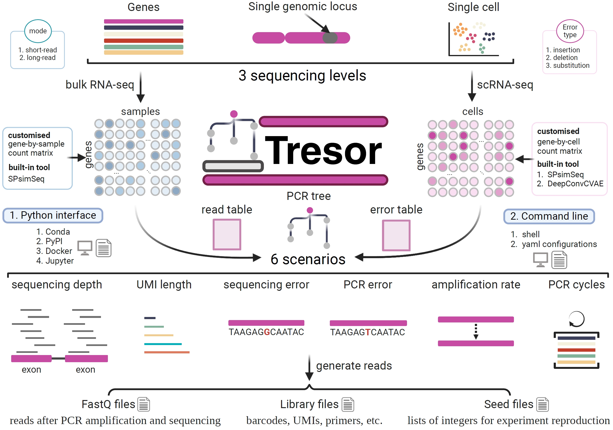

# Welcome to the homepage of { width="60" }Tresor.

> This is where we show how you can use Tresor best.

Tresor is designed to simulate either short-reads or long-reads under bulk RNA-seq and scRNA-seq conditions across six scenarios: specifically by varying sequencing errors, PCR errors, lengths of unique molecular identifiers (UMIs), sequencing depths, numbers of PCR cycles, and PCR amplification rates, respectively. 

:rocket: It runs at a fast speed!

:fontawesome-solid-ear-deaf: A full set of funtionalities of a read simulation tool!

<figure markdown="span">
  { width="800" }
  <figcaption><strong></strong>Tresor workflow</figcaption>
</figure>

## Features

The software outputs sequencing libraries that include comprehensive annotations, enabling the tracking of both the original and PCR-amplified molecules under complex conditions, such as sample multiplexing with Unique Molecular Identifiers (UMIs) and cell barcodes. These features are instrumental in quantifying changes in the number of PCR duplicates across different experiment settings. By providing these detailed annotations, Tensor supports both the evaluation of existing UMI deduplication tools and the spur of the development of novel methodologies.

- [x] The first tool for simulating errors in flexiblely designed sequencing protocols during bead synthesis
- [x] Installation package
    * [x] PyPI
    * [x] Conda
    * [x] Docker
    * [x] Github
- [x] Sequencing technology
    * [x] Short reads (Illumina)
    * [x] Long reads (Oxford Nanopore Technologies)
- [x] Sequencing level
    * [x] Single genomic locus
    * [x] Bulk RNA-seq
    * [x] single-cell (sc) RNA-seq

## Programming

Tresor is implemented with Python, which can be accessed through both Python and Shell commands. 

* `language` - Python
* `module` - Object Oriented Programming (OOP) & Aspect Oriented Programming (AOP)
* `command` - Python and Shell

``` py
$ import tresor as ts
ts.locus
ts.gene
ts.sc
```
Or
``` sh
$ tresor function_name -cfpn configuration.yml ...
```