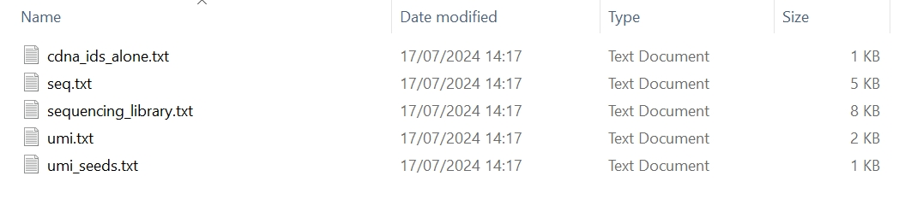
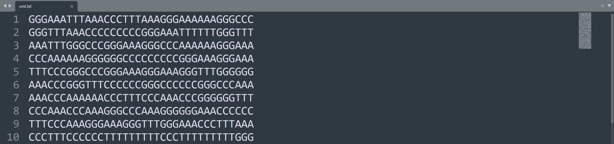
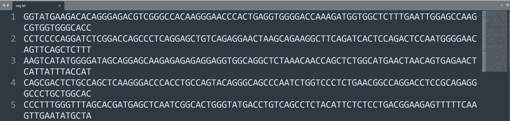
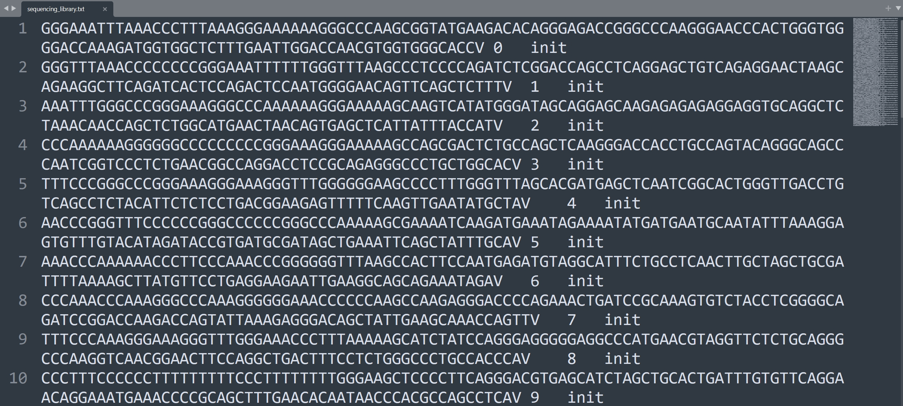
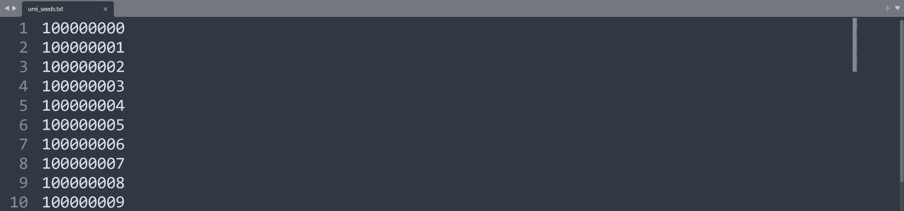
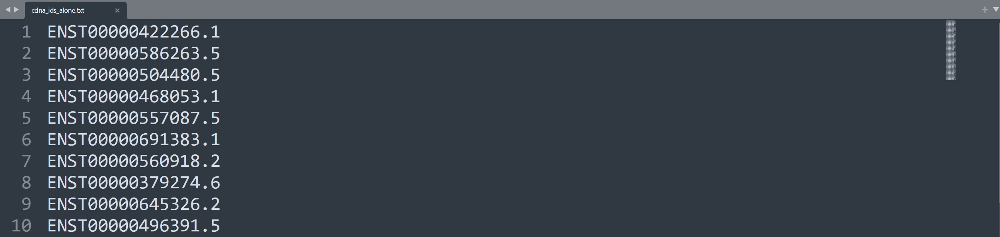

`tresor.locus.library` is the module that can simulate sequencing libraries at a given single locus. A single genomic locus represents where a genome segment is fragmented into pieces for sequencing, irrespective of information on specific genes and cells. Therefore, this can be treated as a baseline to validate users' hypotheses and evaluate tool performance.

# Usage

=== "Python"

    ``` py linenums="1"
    import tresor as ts

    ts.locus.library(
        seq_num=50,
        len_params={
            'umi': {
                'umi_unit_pattern': 2,
                'umi_unit_len': 12,
            },
        },
        seq_params={
            'custom': 'AAGC',  # BAGC
            'custom_1': 'V',
        },
        material_params={
            'fasta_cdna_fpn': to('data/Homo_sapiens.GRCh38.cdna.all.fa.gz'),  # None False
        },
        is_seed=True,

        working_dir=to('data/simu/docs/'),

        condis=['umi', 'custom', 'seq', 'custom_1'],
        sim_thres=3,
        permutation=0,

        mode='short_read',  # long_read short_read

        verbose=True,  # False True
    )
    
    ```

=== "Shell"

    ``` c++ linenums="1"
    tresor library_sl \
    -cfpn ./tresor/data/libslocus.yml \
    -snum 50 \
    -permut 0 \
    -sthres 3 \
    -wd ./tresor/data/simu/ \
    -md short_read \
    -is True \
    -vb True

    ```


# Attributes
!!! Illustration

    === "Python"
        | Attribute      | Description                          |
        | :---------- | :----------------------------------- |
        | `seq_num`       | number of RNA molecules. `50` by default  |
        | `len_params`       | lengths of different components of a read |
        | `seq_params`    | sequences of different components of a read, It allows users to add their customised sequences |
        | `material_params`    | a Python dictionary. Showing if cDNA libraries are provided, please use key word `fasta_cdna_fpn`. The human cDNA library can be downloaded through the [Ensembl genome](https://ftp.ensembl.org/pub/release-112/fasta/homo_sapiens/cdna) database |
        | `is_seed`    | if seeds are used to simulate sequencing libraries. This is designed to make in silico experiments reproducible |
        | `working_dir`    | working directory where all simulation results are about to be saved |
        | `condis`    | names of components that a read contains. It can contains an unlimited number of read components |
        | `sim_thres`    | similarity threshold. `3` by default |
        | `permutation`    | permutation times |
        | `mode` | `long_read` or `short_read` |
        | `verbose` | whether to print intermediate results |
        

    === "Shell"
        | Attribute      | Description                          |
        | :---------- | :----------------------------------- |
        | `cfpn` | location to the yaml configuration file. Users can specify the atrributes illustrated on the **Python** tab in the `.yml` file. |
        | `snum` | number of sequencing molecules |
        | `permut` | permutation times |
        | `sthres` | similarity threshold. `3` by default |
        | `wd` | working directory where all simulation results are about to be saved |
        | `md` | `long_read` or `short_read` mode |
        | `is` | if seeds are used to simulate sequencing libraries. This is designed for reproducible in silico experiments |
        | `vb` | whether to print intermediate results |

        ```

# Extension

!!! tip

    We can flexibly design the structure of a read by adding different components to `condis` separated by comma. For example, there is an initial read containing only a UMI.
    ``` py
    condis=['umi'],
    ```

    Next, we can add a `seq` next to it.
    ``` py
    condis=['umi', 'seq'],
    ```

    If we have a read containing many bespoke parts, `primer`, `primer_1`, `spacer`, `spacer_1`, `adapter`, `adapter_1`,`umi`, `umi_1`, 'seq', and 'seq_2', we can set `condis` just as
    ``` py
    condis=['umi', 'primer', 'primer_1', 'spacer', 'spacer_1', 'adapter', 'adapter_1', 'seq', 'seq_2', 'umi_1'],
    ```

    Then, we can add the corresponding lengths of the parts/components in `len_params` as follows.
    ``` py
    len_params={
        'umi': {
            'umi_unit_pattern': 3,
            'umi_unit_len': 12,
        },
        'umi_1': {
            'umi_unit_pattern': 3,
            'umi_unit_len': 12,
        },
        'seq': 100,
        'seq_2': 100,
        'adapter': 10,
        'adapter_1': 10,
        'primer': 10,
        'primer_1': 10,
        'spacer': 10,
        'spacer_1': 10,
    },
    ```
    
    If you have known sequences of some components in read 1, you can use `seq_params` to specify customed sequences.
    The following settings were used in our recently released biotechnology, [anchor-enhanced technology](https://www.biorxiv.org/content/10.1101/2024.04.08.587145v2), for elevating the discovery of long-reads. We placed an anchor sequence `BAGC` and a `V` base in between the read 1 sequence where B means any type of a base. Tresor was used for simulating reads with the two custom sequences placed as follows.
    ``` py
    seq_params={
        'custom': 'AAGC',  # BAGC
        'custom_1': 'V',
    },
    ```


# Output
## Console
``` py
D:\Programming\anaconda3\envs\umi\python.exe D:\Document\Programming\Python\tresor\tresor\locus.py 
17/07/2024 14:04:15 logger: Initialisation and parameters: 
{'seq_params': {'custom': 'AAGC', 'custom_1': 'V'}, 'material_params': {'fasta_cdna_fpn': 'D:\\Document\\Programming\\Python\\tresor\\tresor\\data/Homo_sapiens.GRCh38.cdna.all.fa.gz'}, 'mode': 'short_read', 'bead_mutation': True, 'bead_mut_rate': 0.0001, 'bead_deletion': True, 'bead_del_rate': 0.016, 'bead_insertion': True, 'bead_ins_rate': 7.1e-07}
17/07/2024 14:04:15 logger: ======>Sequencing library preparation starts
17/07/2024 14:04:15 logger: ======>Condition map: {'umi': ['alone'], 'custom': ['alone', '1'], 'seq': ['alone']}
17/07/2024 14:04:15 logger: ======>Read CDNAs from a reference ome
17/07/2024 14:04:21 logger: ======>There are 204083 genes in the reference genome
17/07/2024 14:04:21 logger: ======>Read 1 generation
17/07/2024 14:04:21 logger: =========>UMI generation start
17/07/2024 14:04:21 logger: ============>UMI condition 0: umi
17/07/2024 14:04:21 logger: =========>Sequence generation start
17/07/2024 14:04:21 logger: ============>Sequence condition 0: seq
17/07/2024 14:04:21 logger: ============>Custom-designed condition 0: custom
17/07/2024 14:04:21 logger: ============>Custom-designed condition 1: custom_1
{'umi': 'GGGAAATTTAAACCCTTTAAAGGGAAAAAAGGGCCC', 'seq': 'GGTATGAAGACACAGGGAGACGTCGGGCCACAAGGGAACCCACTGAGGTGGGGACCAAAGATGGTGGCTCTTTGAATTGGAGCCAAGCGTGGTGGGCACC', 'custom': 'AAGC', 'custom_1': 'V'}
{'read_mut': {'mark': False}, 'read_del': {'mark': True}, 'read_ins': {'mark': False}}
17/07/2024 14:04:21 logger: ======>Read 2 generation
17/07/2024 14:04:21 logger: =========>UMI generation start
17/07/2024 14:04:21 logger: ============>UMI condition 0: umi
17/07/2024 14:04:21 logger: =========>Sequence generation start
17/07/2024 14:04:21 logger: ============>Sequence condition 0: seq
17/07/2024 14:04:21 logger: ============>Custom-designed condition 0: custom
17/07/2024 14:04:21 logger: ============>Custom-designed condition 1: custom_1
{'umi': 'GGGTTTAAACCCCCCCCCGGGAAATTTTTTGGGTTT', 'seq': 'CCTCCCCAGGATCTCGGACCAGCCCTCAGGAGCTGTCAGAGGAACTAAGCAGAAGGCTTCAGATCACTCCAGACTCCAATGGGGAACAGTTCAGCTCTTT', 'custom': 'AAGC', 'custom_1': 'V'}
{'read_mut': {'mark': False}, 'read_del': {'mark': True}, 'read_ins': {'mark': False}}
17/07/2024 14:04:21 logger: ======>Read 3 generation
17/07/2024 14:04:21 logger: =========>UMI generation start
17/07/2024 14:04:21 logger: ============>UMI condition 0: umi
17/07/2024 14:04:21 logger: =========>Sequence generation start
17/07/2024 14:04:21 logger: ============>Sequence condition 0: seq
17/07/2024 14:04:21 logger: ============>Custom-designed condition 0: custom
17/07/2024 14:04:21 logger: ============>Custom-designed condition 1: custom_1
{'umi': 'AAATTTGGGCCCGGGAAAGGGCCCAAAAAAGGGAAA', 'seq': 'AAGTCATATGGGGATAGCAGGAGCAAGAGAGAGAGGAGGTGGCAGGCTCTAAACAACCAGCTCTGGCATGAACTAACAGTGAGAACTCATTATTTACCAT', 'custom': 'AAGC', 'custom_1': 'V'}
{'read_mut': {'mark': False}, 'read_del': {'mark': True}, 'read_ins': {'mark': False}}
17/07/2024 14:04:21 logger: ======>Read 4 generation
17/07/2024 14:04:21 logger: =========>UMI generation start
17/07/2024 14:04:21 logger: ============>UMI condition 0: umi
17/07/2024 14:04:21 logger: =========>Sequence generation start
17/07/2024 14:04:21 logger: ============>Sequence condition 0: seq
17/07/2024 14:04:21 logger: ============>Custom-designed condition 0: custom
17/07/2024 14:04:21 logger: ============>Custom-designed condition 1: custom_1
{'umi': 'CCCAAAAAAGGGGGGCCCCCCCCCGGGAAAGGGAAA', 'seq': 'CAGCGACTCTGCCAGCTCAAGGGACCCACCTGCCAGTACAGGGCAGCCCAATCTGGTCCCTCTGAACGGCCAGGACCTCCGCAGAGGGCCCTGCTGGCAC', 'custom': 'AAGC', 'custom_1': 'V'}
{'read_mut': {'mark': False}, 'read_del': {'mark': True}, 'read_ins': {'mark': False}}
17/07/2024 14:04:21 logger: ======>Read 5 generation
17/07/2024 14:04:21 logger: =========>UMI generation start
17/07/2024 14:04:21 logger: ============>UMI condition 0: umi
17/07/2024 14:04:21 logger: =========>Sequence generation start
17/07/2024 14:04:21 logger: ============>Sequence condition 0: seq
17/07/2024 14:04:21 logger: ============>Custom-designed condition 0: custom
17/07/2024 14:04:21 logger: ============>Custom-designed condition 1: custom_1
{'umi': 'TTTCCCGGGCCCGGGAAAGGGAAAGGGTTTGGGGGG', 'seq': 'CCCTTTGGGTTTAGCACGATGAGCTCAATCGGCACTGGGTATGACCTGTCAGCCTCTACATTCTCTCCTGACGGAAGAGTTTTTCAAGTTGAATATGCTA', 'custom': 'AAGC', 'custom_1': 'V'}
{'read_mut': {'mark': False}, 'read_del': {'mark': True}, 'read_ins': {'mark': False}}
17/07/2024 14:04:21 logger: ======>Read 6 generation
17/07/2024 14:04:21 logger: =========>UMI generation start
17/07/2024 14:04:21 logger: ============>UMI condition 0: umi
17/07/2024 14:04:21 logger: =========>Sequence generation start
17/07/2024 14:04:21 logger: ============>Sequence condition 0: seq
17/07/2024 14:04:21 logger: ============>Custom-designed condition 0: custom
17/07/2024 14:04:21 logger: ============>Custom-designed condition 1: custom_1
{'umi': 'AAACCCGGGTTTCCCCCCGGGCCCCCCGGGCCCAAA', 'seq': 'GAAAATCAAGATGAAATAGAAAATATGATGAATGCAATATTTAAAGGAGTGTTTGTACATAGATACCGTGATGCGATAGCTGAAATTCGAGCTATTTGCA', 'custom': 'AAGC', 'custom_1': 'V'}
{'read_mut': {'mark': False}, 'read_del': {'mark': True}, 'read_ins': {'mark': False}}
17/07/2024 14:04:21 logger: ======>Read 7 generation
17/07/2024 14:04:21 logger: =========>UMI generation start
17/07/2024 14:04:21 logger: ============>UMI condition 0: umi
17/07/2024 14:04:21 logger: =========>Sequence generation start
17/07/2024 14:04:21 logger: ============>Sequence condition 0: seq
17/07/2024 14:04:21 logger: ============>Custom-designed condition 0: custom
17/07/2024 14:04:21 logger: ============>Custom-designed condition 1: custom_1
{'umi': 'AAACCCAAAAAACCCTTTCCCAAACCCGGGGGGTTT', 'seq': 'CACTTCCAAATTTGAGATGTAGGCATTTCTGCCTCAACTTGCTAGCTGCGATTTTAAAAGCTTATGTTCCTGAGGAAGAATTGAAGGCAGCAGAAATAGA', 'custom': 'AAGC', 'custom_1': 'V'}
{'read_mut': {'mark': False}, 'read_del': {'mark': True}, 'read_ins': {'mark': False}}
17/07/2024 14:04:21 logger: ======>Read 8 generation
17/07/2024 14:04:21 logger: =========>UMI generation start
17/07/2024 14:04:21 logger: ============>UMI condition 0: umi
17/07/2024 14:04:21 logger: =========>Sequence generation start
17/07/2024 14:04:21 logger: ============>Sequence condition 0: seq
17/07/2024 14:04:21 logger: ============>Custom-designed condition 0: custom
17/07/2024 14:04:21 logger: ============>Custom-designed condition 1: custom_1
{'umi': 'CCCAAACCCAAAGGGCCCAAAGGGGGGAAACCCCCC', 'seq': 'CAAGAGGGACCCCAGAAACTGATCCGCAAAGTGTCTACCTCGGGGCAGATCCGGACCAAGACCAGTATTAAAGAGGGACAGCTATTGAAGCAAACCAGTT', 'custom': 'AAGC', 'custom_1': 'V'}
{'read_mut': {'mark': False}, 'read_del': {'mark': True}, 'read_ins': {'mark': False}}
17/07/2024 14:04:21 logger: ======>Read 9 generation
17/07/2024 14:04:21 logger: =========>UMI generation start
17/07/2024 14:04:21 logger: ============>UMI condition 0: umi
17/07/2024 14:04:21 logger: =========>Sequence generation start
17/07/2024 14:04:21 logger: ============>Sequence condition 0: seq
17/07/2024 14:04:21 logger: ============>Custom-designed condition 0: custom
17/07/2024 14:04:21 logger: ============>Custom-designed condition 1: custom_1
{'umi': 'TTTCCCAAAGGGAAAGGGTTTGGGAAACCCTTTAAA', 'seq': 'ATCTATCCAGGGAGGGGGAGGCCCATGAACGTAGGTTCTCTGCAGGGCCCAAGGTCAACGGAACATTCCAGGCTGACTTTCCTCTGGGCCCTGCCACCCA', 'custom': 'AAGC', 'custom_1': 'V'}
{'read_mut': {'mark': False}, 'read_del': {'mark': True}, 'read_ins': {'mark': False}}
17/07/2024 14:04:21 logger: ======>Read 10 generation
17/07/2024 14:04:21 logger: =========>UMI generation start
17/07/2024 14:04:21 logger: ============>UMI condition 0: umi
17/07/2024 14:04:21 logger: =========>Sequence generation start
17/07/2024 14:04:21 logger: ============>Sequence condition 0: seq
17/07/2024 14:04:21 logger: ============>Custom-designed condition 0: custom
17/07/2024 14:04:21 logger: ============>Custom-designed condition 1: custom_1
{'umi': 'CCCTTTCCCCCCTTTTTTTTTCCCTTTTTTTTTGGG', 'seq': 'TCCCCTTCAGGGACGTGAGCATCTAGCTGCACTGATTTGTTGTTCAGGAACAGGAAATGAAACCCCGCAGCTTTGAACACAATAACCCACGCCAGCCTCA', 'custom': 'AAGC', 'custom_1': 'V'}
{'read_mut': {'mark': False}, 'read_del': {'mark': True}, 'read_ins': {'mark': False}}
17/07/2024 14:04:21 logger: ======>Read 11 generation
17/07/2024 14:04:21 logger: =========>UMI generation start
17/07/2024 14:04:21 logger: ============>UMI condition 0: umi
17/07/2024 14:04:21 logger: =========>Sequence generation start
17/07/2024 14:04:21 logger: ============>Sequence condition 0: seq
17/07/2024 14:04:21 logger: ============>Custom-designed condition 0: custom
17/07/2024 14:04:21 logger: ============>Custom-designed condition 1: custom_1
{'umi': 'GGGCCCAAACCCGGGAAATTTCCCAAACCCGGGCCC', 'seq': 'GGGAAGATTGGGGCCTTCTGATTATTTTGGTGAAATTGCACTACTGATGAATCGTCCTCGTGCTGCCACAGTTGTTGCTCGTGGCCCCTTGAAGTGCGTT', 'custom': 'AAGC', 'custom_1': 'V'}
{'read_mut': {'mark': False}, 'read_del': {'mark': True}, 'read_ins': {'mark': False}}
17/07/2024 14:04:21 logger: ======>Read 12 generation
17/07/2024 14:04:21 logger: =========>UMI generation start
17/07/2024 14:04:21 logger: ============>UMI condition 0: umi
17/07/2024 14:04:21 logger: =========>Sequence generation start
17/07/2024 14:04:21 logger: ============>Sequence condition 0: seq
17/07/2024 14:04:21 logger: ============>Custom-designed condition 0: custom
17/07/2024 14:04:21 logger: ============>Custom-designed condition 1: custom_1
{'umi': 'GGGTTTGGGCCCTTTGGGGGGAAATTTTTTGGGCCC', 'seq': 'GGCCAGGCGCCTTCTGGACACCGTCTGGAATAAGGGTACTTGGGCCTGTCAGAAGCTCATCGCGGCTGCCCAAGAAGCCCAGGCCGACAGCCAGTCCCCC', 'custom': 'AAGC', 'custom_1': 'V'}
{'read_mut': {'mark': False}, 'read_del': {'mark': True}, 'read_ins': {'mark': False}}
17/07/2024 14:04:21 logger: ======>Read 13 generation
17/07/2024 14:04:21 logger: =========>UMI generation start
17/07/2024 14:04:21 logger: ============>UMI condition 0: umi
17/07/2024 14:04:21 logger: =========>Sequence generation start
17/07/2024 14:04:21 logger: ============>Sequence condition 0: seq
17/07/2024 14:04:21 logger: ============>Custom-designed condition 0: custom
17/07/2024 14:04:21 logger: ============>Custom-designed condition 1: custom_1
{'umi': 'AAAGGGCCCTTTTTTCCCTTTAAACCCCCCCCCAAA', 'seq': 'GGTGAACAGGCGACCATGCTTTTCAGCTCTGGAAGTCGATGAAACATACGTTCCCAAAGAGTTTAATGCTGAAACATTCACCTTCCATGCAGATATATGC', 'custom': 'AAGC', 'custom_1': 'V'}
{'read_mut': {'mark': False}, 'read_del': {'mark': True}, 'read_ins': {'mark': False}}
17/07/2024 14:04:21 logger: ======>Read 14 generation
17/07/2024 14:04:21 logger: =========>UMI generation start
17/07/2024 14:04:21 logger: ============>UMI condition 0: umi
17/07/2024 14:04:21 logger: =========>Sequence generation start
17/07/2024 14:04:21 logger: ============>Sequence condition 0: seq
17/07/2024 14:04:21 logger: ============>Custom-designed condition 0: custom
17/07/2024 14:04:21 logger: ============>Custom-designed condition 1: custom_1
{'umi': 'CCCAAATTTTTTAAAGGGTTTGGGCCCGGGGGGGGG', 'seq': 'CACATTGTCATATGCTAGTGATCTCTATAATGGTTCCAGTATAGTCTCTAGTATTGAATTTGACCGGGATTGTGACTATTTTGCGATTGCTGGAGTTACA', 'custom': 'AAGC', 'custom_1': 'V'}
{'read_mut': {'mark': False}, 'read_del': {'mark': False}, 'read_ins': {'mark': False}}
17/07/2024 14:04:21 logger: ======>Read 15 generation
17/07/2024 14:04:21 logger: =========>UMI generation start
17/07/2024 14:04:21 logger: ============>UMI condition 0: umi
17/07/2024 14:04:21 logger: =========>Sequence generation start
17/07/2024 14:04:21 logger: ============>Sequence condition 0: seq
17/07/2024 14:04:21 logger: ============>Custom-designed condition 0: custom
17/07/2024 14:04:21 logger: ============>Custom-designed condition 1: custom_1
{'umi': 'GGGCCCAAAGGGGGGGGGGGGTTTGGGGGGTTTCCC', 'seq': 'ACTCCAGCCTGGGTGACAAAGTGAGACTCCGTCACAACAACAACAACAAAAAGCTTCCCCAACTAAAGCCTAGAAGAGCTTCTGAGGCGCTGCTTTGTCA', 'custom': 'AAGC', 'custom_1': 'V'}
{'read_mut': {'mark': False}, 'read_del': {'mark': True}, 'read_ins': {'mark': False}}
17/07/2024 14:04:21 logger: ======>Read 16 generation
17/07/2024 14:04:21 logger: =========>UMI generation start
17/07/2024 14:04:21 logger: ============>UMI condition 0: umi
17/07/2024 14:04:21 logger: =========>Sequence generation start
17/07/2024 14:04:21 logger: ============>Sequence condition 0: seq
17/07/2024 14:04:21 logger: ============>Custom-designed condition 0: custom
17/07/2024 14:04:21 logger: ============>Custom-designed condition 1: custom_1
{'umi': 'CCCAAATTTTTTTTTAAAGGGGGGCCCCCCCCCGGG', 'seq': 'AGACCCCTTGACATCAAGCTCTCTGGGAAGTGGAGCACTGATGATATGCAGATCAATGGCATTTCCCTGCAGGATTACACTGCAGTGAAGGAGAAGTATG', 'custom': 'AAGC', 'custom_1': 'V'}
{'read_mut': {'mark': False}, 'read_del': {'mark': True}, 'read_ins': {'mark': False}}
17/07/2024 14:04:21 logger: ======>Read 17 generation
17/07/2024 14:04:21 logger: =========>UMI generation start
17/07/2024 14:04:21 logger: ============>UMI condition 0: umi
17/07/2024 14:04:21 logger: =========>Sequence generation start
17/07/2024 14:04:21 logger: ============>Sequence condition 0: seq
17/07/2024 14:04:21 logger: ============>Custom-designed condition 0: custom
17/07/2024 14:04:21 logger: ============>Custom-designed condition 1: custom_1
{'umi': 'GGGGGGTTTGGGAAAAAAGGGTTTCCCGGGGGGCCC', 'seq': 'CATTAAAAAGGGTCTTGCTGCAAAGAGAAAAAGGATTGAAAGCGTTGCAAAAGCTTGCAACGAAACAAACAACAAAATTAAACGTATTTTGAGAACAATA', 'custom': 'AAGC', 'custom_1': 'V'}
{'read_mut': {'mark': False}, 'read_del': {'mark': True}, 'read_ins': {'mark': False}}
17/07/2024 14:04:21 logger: ======>Read 18 generation
17/07/2024 14:04:21 logger: =========>UMI generation start
17/07/2024 14:04:21 logger: ============>UMI condition 0: umi
17/07/2024 14:04:21 logger: =========>Sequence generation start
17/07/2024 14:04:21 logger: ============>Sequence condition 0: seq
17/07/2024 14:04:21 logger: ============>Custom-designed condition 0: custom
17/07/2024 14:04:21 logger: ============>Custom-designed condition 1: custom_1
{'umi': 'TTTCCCGGGAAAAAATTTTTTCCCAAAGGGCCCCCC', 'seq': 'GAAGCCCGCCGCCTCCCCGCGGCCCCGGCGAGCAGCCGCCGCCCGCCGCACCCATGAGCATGTCAGTGAAAAAACCAGTGAATCGCCTTCCAAACCAGGA', 'custom': 'AAGC', 'custom_1': 'V'}
{'read_mut': {'mark': False}, 'read_del': {'mark': True}, 'read_ins': {'mark': False}}
17/07/2024 14:04:21 logger: ======>Read 19 generation
17/07/2024 14:04:21 logger: =========>UMI generation start
17/07/2024 14:04:21 logger: ============>UMI condition 0: umi
17/07/2024 14:04:21 logger: =========>Sequence generation start
17/07/2024 14:04:21 logger: ============>Sequence condition 0: seq
17/07/2024 14:04:21 logger: ============>Custom-designed condition 0: custom
17/07/2024 14:04:21 logger: ============>Custom-designed condition 1: custom_1
{'umi': 'AAATTTGGGCCCCCCAAACCCCCCTTTGGGGGGAAA', 'seq': 'AGACTAGGCGATCCTCACTTCTACCAGGACTCTTTGTGGCTGCGCAAGGAGTTCATGCAAGTTCGAAGGTGACCTCTTGTCACACTGATGGATACTTTTC', 'custom': 'AAGC', 'custom_1': 'V'}
{'read_mut': {'mark': False}, 'read_del': {'mark': True}, 'read_ins': {'mark': False}}
17/07/2024 14:04:21 logger: ======>Read 20 generation
17/07/2024 14:04:21 logger: =========>UMI generation start
17/07/2024 14:04:21 logger: ============>UMI condition 0: umi
17/07/2024 14:04:21 logger: =========>Sequence generation start
17/07/2024 14:04:21 logger: ============>Sequence condition 0: seq
17/07/2024 14:04:21 logger: ============>Custom-designed condition 0: custom
17/07/2024 14:04:21 logger: ============>Custom-designed condition 1: custom_1
{'umi': 'GGGGGGCCCAAAAAAAAACCCGGGGGGGGGAAAGGG', 'seq': 'TGGAGGCCGCGGACATTTTGGTGCCAAGCCGAACCGAGCCGGGGCGCCGGGAGCTATTGGGACCTGCGGCCTGGCTACAGATAAGGGACCAAAATGACTG', 'custom': 'AAGC', 'custom_1': 'V'}
{'read_mut': {'mark': False}, 'read_del': {'mark': True}, 'read_ins': {'mark': False}}
17/07/2024 14:04:21 logger: ======>Read 21 generation
17/07/2024 14:04:21 logger: =========>UMI generation start
17/07/2024 14:04:21 logger: ============>UMI condition 0: umi
17/07/2024 14:04:21 logger: =========>Sequence generation start
17/07/2024 14:04:21 logger: ============>Sequence condition 0: seq
17/07/2024 14:04:21 logger: ============>Custom-designed condition 0: custom
17/07/2024 14:04:21 logger: ============>Custom-designed condition 1: custom_1
{'umi': 'TTTTTTTTTGGGCCCGGGAAAAAACCCAAAGGGGGG', 'seq': 'TCTCCTCGTCGTCCTCCGGAGCCGAGACGTCCGCATCCGGCGGCAGCGGAAGCCCAGGAGCCTGCCCTGCCCTGGGGACGAAGAGCTGCAGCTCCTCCTG', 'custom': 'AAGC', 'custom_1': 'V'}
{'read_mut': {'mark': False}, 'read_del': {'mark': True}, 'read_ins': {'mark': False}}
17/07/2024 14:04:21 logger: ======>Read 22 generation
17/07/2024 14:04:21 logger: =========>UMI generation start
17/07/2024 14:04:21 logger: ============>UMI condition 0: umi
17/07/2024 14:04:21 logger: =========>Sequence generation start
17/07/2024 14:04:21 logger: ============>Sequence condition 0: seq
17/07/2024 14:04:21 logger: ============>Custom-designed condition 0: custom
17/07/2024 14:04:21 logger: ============>Custom-designed condition 1: custom_1
{'umi': 'AAATTTGGGGGGAAACCCTTTTTTCCCGGGCCCCCC', 'seq': 'CCAATGGTCTATCAGGAAGTAGAAGAGCAGATCCAAACGATCAAAGATGTTGCTGGAGATAAATAGGCAGAAGGAAGAAGAGGACCTCAAATTACAATTG', 'custom': 'AAGC', 'custom_1': 'V'}
{'read_mut': {'mark': False}, 'read_del': {'mark': True}, 'read_ins': {'mark': False}}
17/07/2024 14:04:21 logger: ======>Read 23 generation
17/07/2024 14:04:21 logger: =========>UMI generation start
17/07/2024 14:04:21 logger: ============>UMI condition 0: umi
17/07/2024 14:04:21 logger: =========>Sequence generation start
17/07/2024 14:04:21 logger: ============>Sequence condition 0: seq
17/07/2024 14:04:21 logger: ============>Custom-designed condition 0: custom
17/07/2024 14:04:21 logger: ============>Custom-designed condition 1: custom_1
{'umi': 'AAATTTTTTAAACCCAAAAAAAAAAAATTTTTTCCC', 'seq': 'TTCAGCAGTTGCCTCAATTAAGGCCTTGGAACCAGGGAGTGAAAAAAATAGATCCTGATTTATATGAAAAGTTTATCAGTCACAGATTTGGAGAAGAAAT', 'custom': 'AAGC', 'custom_1': 'V'}
{'read_mut': {'mark': False}, 'read_del': {'mark': False}, 'read_ins': {'mark': False}}
17/07/2024 14:04:21 logger: ======>Read 24 generation
17/07/2024 14:04:21 logger: =========>UMI generation start
17/07/2024 14:04:21 logger: ============>UMI condition 0: umi
17/07/2024 14:04:21 logger: =========>Sequence generation start
17/07/2024 14:04:21 logger: ============>Sequence condition 0: seq
17/07/2024 14:04:21 logger: ============>Custom-designed condition 0: custom
17/07/2024 14:04:21 logger: ============>Custom-designed condition 1: custom_1
{'umi': 'CCCCCCGGGGGGAAAAAATTTCCCTTTGGGAAACCC', 'seq': 'CTGGCATCGGCTAGTGGGTCAGTGTGGATGGCGGGGGCGGGGTATGAGCTAGTCCTCTGTCTCCCACCAGATGTGCTGTGATCACCGAGTTTGCTCGCAT', 'custom': 'AAGC', 'custom_1': 'V'}
{'read_mut': {'mark': False}, 'read_del': {'mark': True}, 'read_ins': {'mark': False}}
17/07/2024 14:04:21 logger: ======>Read 25 generation
17/07/2024 14:04:21 logger: =========>UMI generation start
17/07/2024 14:04:21 logger: ============>UMI condition 0: umi
17/07/2024 14:04:21 logger: =========>Sequence generation start
17/07/2024 14:04:21 logger: ============>Sequence condition 0: seq
17/07/2024 14:04:21 logger: ============>Custom-designed condition 0: custom
17/07/2024 14:04:21 logger: ============>Custom-designed condition 1: custom_1
{'umi': 'GGGTTTTTTCCCTTTCCCAAAGGGCCCGGGCCCGGG', 'seq': 'CTCTCCCCGGCCCCACTCGCCAGGTCCTACCACGATGCCTGACTCGTTTGCGGCTTTGGGACCGGTTGTAGGTGGCTTGACCGTCACTAGTAGACGTTTC', 'custom': 'AAGC', 'custom_1': 'V'}
{'read_mut': {'mark': False}, 'read_del': {'mark': True}, 'read_ins': {'mark': False}}
17/07/2024 14:04:21 logger: ======>Read 26 generation
17/07/2024 14:04:21 logger: =========>UMI generation start
17/07/2024 14:04:21 logger: ============>UMI condition 0: umi
17/07/2024 14:04:21 logger: =========>Sequence generation start
17/07/2024 14:04:21 logger: ============>Sequence condition 0: seq
17/07/2024 14:04:21 logger: ============>Custom-designed condition 0: custom
17/07/2024 14:04:21 logger: ============>Custom-designed condition 1: custom_1
{'umi': 'AAAGGGAAATTTAAAAAAGGGGGGCCCGGGAAAGGG', 'seq': 'ACTCAAACACTCCCAGAGGACGGCACTCTGCATGGGACGCCATCCAGCTCCTTTGACTGTGGAATCAAGTACATTATCAGCTGGCCCCTGGCTCCTGGCT', 'custom': 'AAGC', 'custom_1': 'V'}
{'read_mut': {'mark': False}, 'read_del': {'mark': True}, 'read_ins': {'mark': False}}
17/07/2024 14:04:21 logger: ======>Read 27 generation
17/07/2024 14:04:21 logger: =========>UMI generation start
17/07/2024 14:04:21 logger: ============>UMI condition 0: umi
17/07/2024 14:04:21 logger: =========>Sequence generation start
17/07/2024 14:04:21 logger: ============>Sequence condition 0: seq
17/07/2024 14:04:21 logger: ============>Custom-designed condition 0: custom
17/07/2024 14:04:21 logger: ============>Custom-designed condition 1: custom_1
{'umi': 'CCCGGGTTTGGGTTTAAACCCTTTTTTTTTAAACCC', 'seq': 'ACAAGTATAATTTTGATACAATGATATATGTGACAGATAAAGGACAAAAAAAGCATTTTCAGCAAGTATTCCAAATGCTGAAGATCATGGGATATGACTG', 'custom': 'AAGC', 'custom_1': 'V'}
{'read_mut': {'mark': False}, 'read_del': {'mark': True}, 'read_ins': {'mark': False}}
17/07/2024 14:04:21 logger: ======>Read 28 generation
17/07/2024 14:04:21 logger: =========>UMI generation start
17/07/2024 14:04:21 logger: ============>UMI condition 0: umi
17/07/2024 14:04:21 logger: =========>Sequence generation start
17/07/2024 14:04:21 logger: ============>Sequence condition 0: seq
17/07/2024 14:04:21 logger: ============>Custom-designed condition 0: custom
17/07/2024 14:04:21 logger: ============>Custom-designed condition 1: custom_1
{'umi': 'GGGGGGCCCGGGAAACCCGGGGGGCCCAAATTTTTT', 'seq': 'GCTGGAGTGCAGTGGAGCAATCTCGGCTCATTGAACCTCTTGGGTTCAAGTGATTCTTGTGCCTCAGCCTCCCAAGTAGCTGGAATTACAGGCACATACC', 'custom': 'AAGC', 'custom_1': 'V'}
{'read_mut': {'mark': False}, 'read_del': {'mark': True}, 'read_ins': {'mark': False}}
17/07/2024 14:04:21 logger: ======>Read 29 generation
17/07/2024 14:04:21 logger: =========>UMI generation start
17/07/2024 14:04:21 logger: ============>UMI condition 0: umi
17/07/2024 14:04:21 logger: =========>Sequence generation start
17/07/2024 14:04:21 logger: ============>Sequence condition 0: seq
17/07/2024 14:04:21 logger: ============>Custom-designed condition 0: custom
17/07/2024 14:04:21 logger: ============>Custom-designed condition 1: custom_1
{'umi': 'CCCAAATTTAAACCCCCCCCCGGGGGGTTTTTTGGG', 'seq': 'CAAGATCCTGCCCGGCCTGTACATCGGCAACTTCAAAGATGCCAGAGACGCGGAACAATTGAGCAAGAACAAGGACAAGACATTTCAAAGAAAGTATTAA', 'custom': 'AAGC', 'custom_1': 'V'}
{'read_mut': {'mark': False}, 'read_del': {'mark': True}, 'read_ins': {'mark': False}}
17/07/2024 14:04:21 logger: ======>Read 30 generation
17/07/2024 14:04:21 logger: =========>UMI generation start
17/07/2024 14:04:21 logger: ============>UMI condition 0: umi
17/07/2024 14:04:21 logger: =========>Sequence generation start
17/07/2024 14:04:21 logger: ============>Sequence condition 0: seq
17/07/2024 14:04:21 logger: ============>Custom-designed condition 0: custom
17/07/2024 14:04:21 logger: ============>Custom-designed condition 1: custom_1
{'umi': 'TTTCCCCCCAAACCCTTTGGGGGGGGGAAAGGGTTT', 'seq': 'ACAGCCGGGCGCCCGTCGGGCTCTGGGAGAGAGCGAGAGAGAAATCCGGTTAAAATCAGAGTCGGAGGGAGGTTTAACCACAGATCGGTTCCGATCGGAT', 'custom': 'AAGC', 'custom_1': 'V'}
{'read_mut': {'mark': False}, 'read_del': {'mark': True}, 'read_ins': {'mark': False}}
17/07/2024 14:04:21 logger: ======>Read 31 generation
17/07/2024 14:04:21 logger: =========>UMI generation start
17/07/2024 14:04:21 logger: ============>UMI condition 0: umi
17/07/2024 14:04:21 logger: =========>Sequence generation start
17/07/2024 14:04:21 logger: ============>Sequence condition 0: seq
17/07/2024 14:04:21 logger: ============>Custom-designed condition 0: custom
17/07/2024 14:04:21 logger: ============>Custom-designed condition 1: custom_1
{'umi': 'TTTCCCCCCGGGCCCTTTAAATTTGGGGGGTTTGGG', 'seq': 'TTGCCCTCTGACTTGCAGATGCTGTGAGATCCAGAGCTAAGACTCCACGACATCCCGGAAGCCGAAAAATGAATCAGTCTCAGTGTTTCCTGTTTGGATT', 'custom': 'AAGC', 'custom_1': 'V'}
{'read_mut': {'mark': False}, 'read_del': {'mark': True}, 'read_ins': {'mark': False}}
17/07/2024 14:04:21 logger: ======>Read 32 generation
17/07/2024 14:04:21 logger: =========>UMI generation start
17/07/2024 14:04:21 logger: ============>UMI condition 0: umi
17/07/2024 14:04:21 logger: =========>Sequence generation start
17/07/2024 14:04:21 logger: ============>Sequence condition 0: seq
17/07/2024 14:04:21 logger: ============>Custom-designed condition 0: custom
17/07/2024 14:04:21 logger: ============>Custom-designed condition 1: custom_1
{'umi': 'GGGAAAAAAGGGGGGCCCTTTTTTAAAAAACCCCCC', 'seq': 'GCAGGGAACTGAGGCCGCCTGCCCACATCCATGTGAGTGACCGTCTGGAAGCAGACCTCCAGCCCCAGTCCCGCCTCTGGAGGACTGCAGCCTGCACCTG', 'custom': 'AAGC', 'custom_1': 'V'}
{'read_mut': {'mark': False}, 'read_del': {'mark': True}, 'read_ins': {'mark': False}}
17/07/2024 14:04:21 logger: ======>Read 33 generation
17/07/2024 14:04:21 logger: =========>UMI generation start
17/07/2024 14:04:21 logger: ============>UMI condition 0: umi
17/07/2024 14:04:21 logger: =========>Sequence generation start
17/07/2024 14:04:21 logger: ============>Sequence condition 0: seq
17/07/2024 14:04:21 logger: ============>Custom-designed condition 0: custom
17/07/2024 14:04:21 logger: ============>Custom-designed condition 1: custom_1
{'umi': 'TTTGGGCCCGGGTTTTTTAAATTTGGGGGGCCCGGG', 'seq': 'GTTATTATTTTAAAAATTAGCTAACTTCTCTCACGGTGTCCTCCCAATATGCACCTTTTGCTCCTAGTGTCCAGATACCTAGCTTTGTATCATTATTTTT', 'custom': 'AAGC', 'custom_1': 'V'}
{'read_mut': {'mark': False}, 'read_del': {'mark': True}, 'read_ins': {'mark': False}}
17/07/2024 14:04:21 logger: ======>Read 34 generation
17/07/2024 14:04:21 logger: =========>UMI generation start
17/07/2024 14:04:21 logger: ============>UMI condition 0: umi
17/07/2024 14:04:21 logger: =========>Sequence generation start
17/07/2024 14:04:21 logger: ============>Sequence condition 0: seq
17/07/2024 14:04:21 logger: ============>Custom-designed condition 0: custom
17/07/2024 14:04:21 logger: ============>Custom-designed condition 1: custom_1
{'umi': 'GGGTTTAAATTTTTTTTTTTTGGGTTTCCCGGGCCC', 'seq': 'GCTGCCTGCTGATCCGCGCCTAGAGTTTGACCAGCCACTCTCCAGCTCGGCTTTCGCGGCGCCGAGATGCTGTCCTGCCGCCTCCAGTGCGCGCTGGCTG', 'custom': 'AAGC', 'custom_1': 'V'}
{'read_mut': {'mark': False}, 'read_del': {'mark': True}, 'read_ins': {'mark': False}}
17/07/2024 14:04:21 logger: ======>Read 35 generation
17/07/2024 14:04:21 logger: =========>UMI generation start
17/07/2024 14:04:21 logger: ============>UMI condition 0: umi
17/07/2024 14:04:21 logger: =========>Sequence generation start
17/07/2024 14:04:21 logger: ============>Sequence condition 0: seq
17/07/2024 14:04:21 logger: ============>Custom-designed condition 0: custom
17/07/2024 14:04:21 logger: ============>Custom-designed condition 1: custom_1
{'umi': 'GGGCCCAAATTTAAAGGGCCCAAACCCCCCAAATTT', 'seq': 'CGCGCCCGGCCAAATAAAATAAAATGTTAAAGCAAATTCAGGACTACCCCTCCTCCAAGTCTTCTGTTCCCTTTGGGCGCCCAGGTGAGCGGGGGAGGGG', 'custom': 'AAGC', 'custom_1': 'V'}
{'read_mut': {'mark': False}, 'read_del': {'mark': True}, 'read_ins': {'mark': False}}
17/07/2024 14:04:21 logger: ======>Read 36 generation
17/07/2024 14:04:21 logger: =========>UMI generation start
17/07/2024 14:04:21 logger: ============>UMI condition 0: umi
17/07/2024 14:04:21 logger: =========>Sequence generation start
17/07/2024 14:04:21 logger: ============>Sequence condition 0: seq
17/07/2024 14:04:21 logger: ============>Custom-designed condition 0: custom
17/07/2024 14:04:21 logger: ============>Custom-designed condition 1: custom_1
{'umi': 'AAAGGGAAACCCAAAAAATTTAAACCCAAATTTGGG', 'seq': 'TTTGGCTGTCCGGACGGTGCAGCGGCGAGGCCGGCCGCGAAGATGCCAGTGGCGGTGATGGCGGAAAGCGCCTTTAGTTTCAAAAAGTTGCTGGATCAGT', 'custom': 'AAGC', 'custom_1': 'V'}
{'read_mut': {'mark': False}, 'read_del': {'mark': True}, 'read_ins': {'mark': False}}
17/07/2024 14:04:21 logger: ======>Read 37 generation
17/07/2024 14:04:21 logger: =========>UMI generation start
17/07/2024 14:04:21 logger: ============>UMI condition 0: umi
17/07/2024 14:04:21 logger: =========>Sequence generation start
17/07/2024 14:04:21 logger: ============>Sequence condition 0: seq
17/07/2024 14:04:21 logger: ============>Custom-designed condition 0: custom
17/07/2024 14:04:21 logger: ============>Custom-designed condition 1: custom_1
{'umi': 'CCCTTTCCCTTTGGGTTTGGGTTTCCCGGGAAACCC', 'seq': 'CTGTGCAGCTGCTGCTCGTGGCAGCCTGGAGCATGGGCTGTGGTGAGGCCCTCAAGTGCTACACCTGCAAGGAGCCCATGACCAGTGCTTCCTGCAGGAC', 'custom': 'AAGC', 'custom_1': 'V'}
{'read_mut': {'mark': False}, 'read_del': {'mark': True}, 'read_ins': {'mark': False}}
17/07/2024 14:04:21 logger: ======>Read 38 generation
17/07/2024 14:04:21 logger: =========>UMI generation start
17/07/2024 14:04:21 logger: ============>UMI condition 0: umi
17/07/2024 14:04:21 logger: =========>Sequence generation start
17/07/2024 14:04:21 logger: ============>Sequence condition 0: seq
17/07/2024 14:04:21 logger: ============>Custom-designed condition 0: custom
17/07/2024 14:04:21 logger: ============>Custom-designed condition 1: custom_1
{'umi': 'GGGTTTAAAGGGAAAGGGTTTGGGAAAGGGAAATTT', 'seq': 'CGGCCCTGACCGCCCCGTGTCCGGCCAGGATCAACTCGTAGGCTTTACGAGAAGAAGATCTTCGAGTACGAGACCCAGAGGCGGCGGCTCTCGCCCCCCA', 'custom': 'AAGC', 'custom_1': 'V'}
{'read_mut': {'mark': False}, 'read_del': {'mark': True}, 'read_ins': {'mark': False}}
17/07/2024 14:04:21 logger: ======>Read 39 generation
17/07/2024 14:04:21 logger: =========>UMI generation start
17/07/2024 14:04:21 logger: ============>UMI condition 0: umi
17/07/2024 14:04:21 logger: =========>Sequence generation start
17/07/2024 14:04:21 logger: ============>Sequence condition 0: seq
17/07/2024 14:04:21 logger: ============>Custom-designed condition 0: custom
17/07/2024 14:04:21 logger: ============>Custom-designed condition 1: custom_1
{'umi': 'TTTGGGGGGAAAGGGAAAAAACCCGGGGGGGGGCCC', 'seq': 'GGCCCCCTGCCTTGAGGAGCAGCCTTTTTGCTTTCTTTCTTTGGGATAGGATGCCTCTGGGGTTCTTTCTCCCGCAGCCGGCTGTGTTTTAGAGCACTTT', 'custom': 'AAGC', 'custom_1': 'V'}
{'read_mut': {'mark': False}, 'read_del': {'mark': True}, 'read_ins': {'mark': False}}
17/07/2024 14:04:21 logger: ======>Read 40 generation
17/07/2024 14:04:21 logger: =========>UMI generation start
17/07/2024 14:04:21 logger: ============>UMI condition 0: umi
17/07/2024 14:04:21 logger: =========>Sequence generation start
17/07/2024 14:04:21 logger: ============>Sequence condition 0: seq
17/07/2024 14:04:21 logger: ============>Custom-designed condition 0: custom
17/07/2024 14:04:21 logger: ============>Custom-designed condition 1: custom_1
{'umi': 'AAAGGGTTTAAACCCAAAGGGTTTGGGGGGAAAAAA', 'seq': 'ACTTAGAACAGCTGGCATCTAACAAAGACTAGCTGTGTCAGCGTGTTATGATGCCGTCCCGTACCAACCTGGCTACTGGAATCCCCAGTAGTAAAGTGAA', 'custom': 'AAGC', 'custom_1': 'V'}
{'read_mut': {'mark': False}, 'read_del': {'mark': False}, 'read_ins': {'mark': False}}
17/07/2024 14:04:21 logger: ======>Read 41 generation
17/07/2024 14:04:21 logger: =========>UMI generation start
17/07/2024 14:04:21 logger: ============>UMI condition 0: umi
17/07/2024 14:04:21 logger: =========>Sequence generation start
17/07/2024 14:04:21 logger: ============>Sequence condition 0: seq
17/07/2024 14:04:21 logger: ============>Custom-designed condition 0: custom
17/07/2024 14:04:21 logger: ============>Custom-designed condition 1: custom_1
{'umi': 'GGGTTTCCCCCCGGGGGGCCCTTTAAAAAAAAATTT', 'seq': 'TCCCTTCTGGGTGTTATGGAAGAGTGGCTCCACGGTCAGGCTTGGCTGCAAAACACTTTATTGATGTAGGAGGGCTTTTGTTTGGGGTAGAGTATTAATA', 'custom': 'AAGC', 'custom_1': 'V'}
{'read_mut': {'mark': False}, 'read_del': {'mark': True}, 'read_ins': {'mark': False}}
17/07/2024 14:04:21 logger: ======>Read 42 generation
17/07/2024 14:04:21 logger: =========>UMI generation start
17/07/2024 14:04:21 logger: ============>UMI condition 0: umi
17/07/2024 14:04:21 logger: =========>Sequence generation start
17/07/2024 14:04:21 logger: ============>Sequence condition 0: seq
17/07/2024 14:04:21 logger: ============>Custom-designed condition 0: custom
17/07/2024 14:04:21 logger: ============>Custom-designed condition 1: custom_1
{'umi': 'GGGCCCGGGGGGAAACCCAAATTTGGGTTTGGGAAA', 'seq': 'TGCAGTTCTGTGAGAGGAAACAACAGCTAACCGGAGCCAGAATTTATACATATTTGCTAGAGAAATCCAGACTTGTTTCACAACCTCTTGGCCAGAGCAA', 'custom': 'AAGC', 'custom_1': 'V'}
{'read_mut': {'mark': False}, 'read_del': {'mark': True}, 'read_ins': {'mark': False}}
17/07/2024 14:04:21 logger: ======>Read 43 generation
17/07/2024 14:04:21 logger: =========>UMI generation start
17/07/2024 14:04:21 logger: ============>UMI condition 0: umi
17/07/2024 14:04:21 logger: =========>Sequence generation start
17/07/2024 14:04:21 logger: ============>Sequence condition 0: seq
17/07/2024 14:04:21 logger: ============>Custom-designed condition 0: custom
17/07/2024 14:04:21 logger: ============>Custom-designed condition 1: custom_1
{'umi': 'AAAAAACCCGGGTTTAAAAAAAAAGGGGGGAAAAAA', 'seq': 'CCCCTCTCCCAGGAGACTGGTCTCTGTGCTGACTTCCACCCGAGTGGGGCAGTTGTGGCCGTAGGACTGAACACGGGGAGGTGGTTGGTTTTGGACACAG', 'custom': 'AAGC', 'custom_1': 'V'}
{'read_mut': {'mark': False}, 'read_del': {'mark': True}, 'read_ins': {'mark': False}}
17/07/2024 14:04:21 logger: ======>Read 44 generation
17/07/2024 14:04:21 logger: =========>UMI generation start
17/07/2024 14:04:21 logger: ============>UMI condition 0: umi
17/07/2024 14:04:21 logger: =========>Sequence generation start
17/07/2024 14:04:21 logger: ============>Sequence condition 0: seq
17/07/2024 14:04:21 logger: ============>Custom-designed condition 0: custom
17/07/2024 14:04:21 logger: ============>Custom-designed condition 1: custom_1
{'umi': 'GGGAAATTTGGGAAATTTAAACCCAAACCCCCCCCC', 'seq': 'CATGCGACCCCCTTTCACCTACGCCACGCTCATCCGCTGGGCCATCCTGGAGGCTCCAGAGAAGCAGCGGACACTCAATGAGATCTACCACTGGTTCACA', 'custom': 'AAGC', 'custom_1': 'V'}
{'read_mut': {'mark': False}, 'read_del': {'mark': True}, 'read_ins': {'mark': False}}
17/07/2024 14:04:21 logger: ======>Read 45 generation
17/07/2024 14:04:21 logger: =========>UMI generation start
17/07/2024 14:04:21 logger: ============>UMI condition 0: umi
17/07/2024 14:04:21 logger: =========>Sequence generation start
17/07/2024 14:04:21 logger: ============>Sequence condition 0: seq
17/07/2024 14:04:21 logger: ============>Custom-designed condition 0: custom
17/07/2024 14:04:21 logger: ============>Custom-designed condition 1: custom_1
{'umi': 'CCCGGGGGGAAAAAACCCTTTCCCGGGCCCTTTAAA', 'seq': 'TCCGCCCTGGCACTTCAGAAACGCTGAAACGTTTCATGGCAGAGCAGCTGAACCAGGAGCAGCAGCAGATTCCTGGAAAACCAGGCACTTTCACTTGGCA', 'custom': 'AAGC', 'custom_1': 'V'}
{'read_mut': {'mark': False}, 'read_del': {'mark': True}, 'read_ins': {'mark': False}}
17/07/2024 14:04:21 logger: ======>Read 46 generation
17/07/2024 14:04:21 logger: =========>UMI generation start
17/07/2024 14:04:21 logger: ============>UMI condition 0: umi
17/07/2024 14:04:21 logger: =========>Sequence generation start
17/07/2024 14:04:21 logger: ============>Sequence condition 0: seq
17/07/2024 14:04:21 logger: ============>Custom-designed condition 0: custom
17/07/2024 14:04:21 logger: ============>Custom-designed condition 1: custom_1
{'umi': 'GGGCCCAAACCCTTTTTTCCCGGGAAACCCCCCGGG', 'seq': 'CTCAAGTGCCTCATCGTGGCCCTGCCCAAGATCATCCTGGCTGTCAAGTCCAAGGGAAAGTTCTATCTGGTCATCGAGGAGCTGAGCCAGCTGTTCCGAT', 'custom': 'AAGC', 'custom_1': 'V'}
{'read_mut': {'mark': False}, 'read_del': {'mark': True}, 'read_ins': {'mark': False}}
17/07/2024 14:04:21 logger: ======>Read 47 generation
17/07/2024 14:04:21 logger: =========>UMI generation start
17/07/2024 14:04:21 logger: ============>UMI condition 0: umi
17/07/2024 14:04:21 logger: =========>Sequence generation start
17/07/2024 14:04:21 logger: ============>Sequence condition 0: seq
17/07/2024 14:04:21 logger: ============>Custom-designed condition 0: custom
17/07/2024 14:04:21 logger: ============>Custom-designed condition 1: custom_1
{'umi': 'AAAAAATTTGGGCCCAAAAAACCCAAACCCGGGAAA', 'seq': 'TGCAAGAATGCCGATGGAGTGGAGTTGTACAATGAGATTGAGTTCTATGCCAAAGTGAACTCCAAGGACTCCCAGGATAAGCGCTCTTCCCGCTCTATTA', 'custom': 'AAGC', 'custom_1': 'V'}
{'read_mut': {'mark': False}, 'read_del': {'mark': True}, 'read_ins': {'mark': False}}
17/07/2024 14:04:21 logger: ======>Read 48 generation
17/07/2024 14:04:21 logger: =========>UMI generation start
17/07/2024 14:04:21 logger: ============>UMI condition 0: umi
17/07/2024 14:04:21 logger: =========>Sequence generation start
17/07/2024 14:04:21 logger: ============>Sequence condition 0: seq
17/07/2024 14:04:21 logger: ============>Custom-designed condition 0: custom
17/07/2024 14:04:21 logger: ============>Custom-designed condition 1: custom_1
{'umi': 'CCCGGGCCCTTTTTTAAAGGGCCCAAACCCAAAAAA', 'seq': 'TTTTAGTCTGTGAACTATAATATTCATGAGACGCTTAACACTTCCCAAAGTGGCAGGGAGGAAACTCTTTGTTTCTTCTGATTCCACCGGAAGAGAGAGT', 'custom': 'AAGC', 'custom_1': 'V'}
{'read_mut': {'mark': False}, 'read_del': {'mark': True}, 'read_ins': {'mark': False}}
17/07/2024 14:04:21 logger: ======>Read 49 generation
17/07/2024 14:04:21 logger: =========>UMI generation start
17/07/2024 14:04:21 logger: ============>UMI condition 0: umi
17/07/2024 14:04:21 logger: =========>Sequence generation start
17/07/2024 14:04:21 logger: ============>Sequence condition 0: seq
17/07/2024 14:04:21 logger: ============>Custom-designed condition 0: custom
17/07/2024 14:04:21 logger: ============>Custom-designed condition 1: custom_1
{'umi': 'CCCAAAAAAGGGCCCAAAGGGCCCTTTGGGGGGCCC', 'seq': 'GGTTACTGTGGGCAGCTTGAAGACCTCAGCGGTGCCCAGTACCTCCACGATGTCCCAAGAGCCTGAGCTCCTCATCAGTGGAATGGAAAAGCCCCTCCCT', 'custom': 'AAGC', 'custom_1': 'V'}
{'read_mut': {'mark': False}, 'read_del': {'mark': True}, 'read_ins': {'mark': False}}
17/07/2024 14:04:21 logger: ======>Read 50 generation
17/07/2024 14:04:21 logger: =========>UMI generation start
17/07/2024 14:04:21 logger: ============>UMI condition 0: umi
17/07/2024 14:04:21 logger: =========>Sequence generation start
17/07/2024 14:04:21 logger: ============>Sequence condition 0: seq
17/07/2024 14:04:21 logger: ============>Custom-designed condition 0: custom
17/07/2024 14:04:21 logger: ============>Custom-designed condition 1: custom_1
{'umi': 'TTTTTTAAATTTAAAAAAGGGAAAGGGGGGGGGCCC', 'seq': 'ACATTGGCAGCTGTGCCCGGAGAGGCCTCCAGGGTCCAGCAGAGAAAGGAGTCGAAGAAGCCACCAGCCAAGCTGCAGCCCCGAGCTCTAGCAGGCTGGC', 'custom': 'AAGC', 'custom_1': 'V'}
{'read_mut': {'mark': False}, 'read_del': {'mark': True}, 'read_ins': {'mark': False}}
0
0
0
17/07/2024 14:04:21 logger: ===>Time for sequencing library preparation: 6.757s

Process finished with exit code 0

```

## Understanding files
The resultant files of the simulated sequencing library are shown in the following picture.

<figure markdown="span">
  { width="800" }
  <figcaption><strong>Fig</strong> 1. Generated files of a sequencing library</figcaption>
</figure>

In this case, we used homotrimer blocks to simulate UMIs where the length of each UMI is set to be 36 containing 12 trimer blocks.

<figure markdown="span">
  { width="800" }
  <figcaption><strong>Fig</strong> 2. Simulated UMIs</figcaption>
</figure>

The sequences are randomly chosen from the input human cDNAs and truncated according to the length of each short read. 
<figure markdown="span">
  { width="800" }
  <figcaption><strong>Fig</strong> 3. Simulated genomics sequences</figcaption>
</figure>

The sequencing library is tabulated to a dataframe. Each row shows the necessary information about the read 1

1. Sequence
2. Identifier
3. Source

Init means a read 1 is a sequence from the sequencing library, to differ from those from PCR amplification.

<figure markdown="span">
  { width="800" }
  <figcaption><strong>Fig</strong> 4. Simulated sequencing library</figcaption>
</figure>

We set a big integer as an initial seed to sequentially simulate each UMI sequence. Then, users can use the saved seeds to reproduce the experiment.

<figure markdown="span">
  { width="800" }
  <figcaption><strong>Fig</strong> 5. Seeds for simulating UMIs </figcaption>
</figure>

The chosen gene symbols are recorded, each corresponding to the source of the truncated sequence by order.
<figure markdown="span">
  { width="800" }
  <figcaption><strong>Fig</strong> 6. Seeds for simulating cDNAs </figcaption>
</figure>