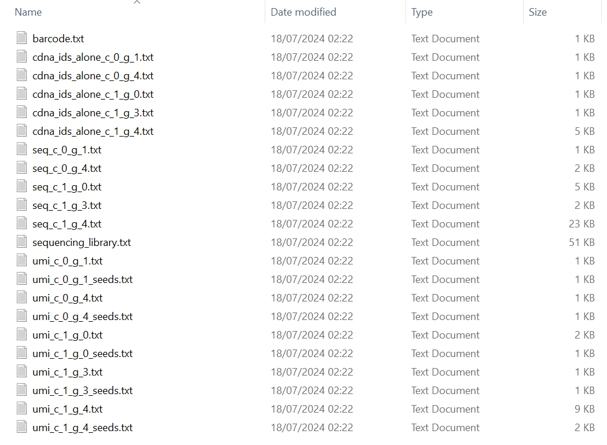
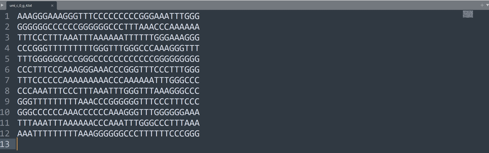
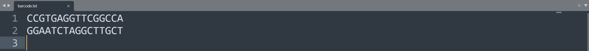
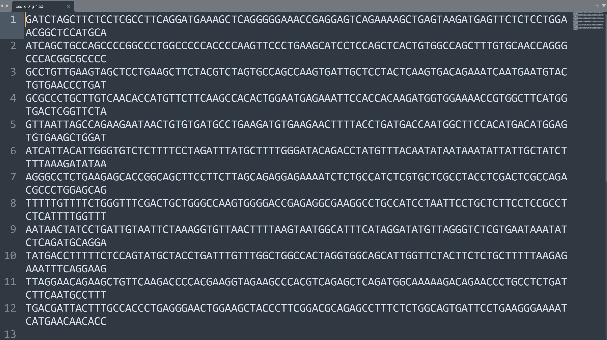
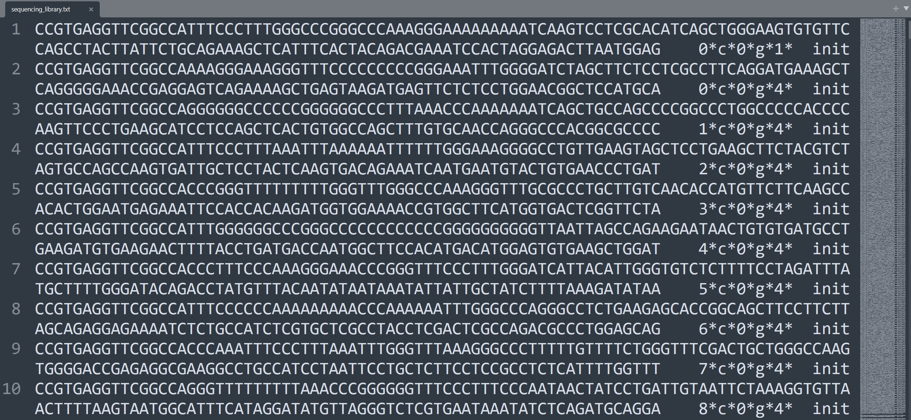
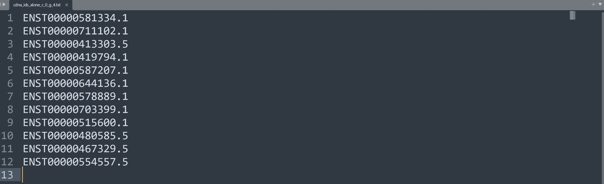

`tresor.sc.library` is the module that can simulate sequencing libraries at the single-cell RNA-seq (scRNA-seq) level. This is used to simulate reads that are tagged by genes expressed in cells, respectively.

# Usage

=== "Python"

    ``` py hl_lines="2-5 20"
    ts.sc.library(
        r_root='D:/Programming/R/R-4.3.2/',
        num_genes=6,
        num_cells=2,
        simulator='spsimseq',

        seq_num=50,
        len_params={
            'umi': {
                'umi_unit_pattern': 3,
                'umi_unit_len': 12,
            },
            'seq': 100,
        },
        seq_params={
            'custom': 'BAGC',
            'custom_1': 'V',
        },
        material_params={
            'bc_lib_fpn': to('data/3M-february-2018.txt'),  # None
            'fasta_cdna_fpn': to('data/Homo_sapiens.GRCh38.cdna.all.fa.gz'),  # None False
        },
        is_seed=True,

        working_dir=to('data/simu/docs/'),

        condis=['umi', 'custom', 'seq', 'custom_1'],

        sim_thres=3,
        permutation=0,

        mode='short_read',  # long_read short_read

        verbose=False,
    )
    
    ```

=== "Shell"

    ``` c++ linenums="1"
    tresor library_sc \
    -cfpn ./tresor/data/libgene.yml \
    -snum 50 \
    -rfpn D:/Programming/R/R-4.3.2/ \
    -ncell 2 \
    -ngene 20 \
    -gsimulator spsimseq \
    -permut 0 \
    -sthres 3 \
    -wd ./tresor/data/simu/ \
    -md short_read \
    -is True \
    -vb True
    ```

Code highlighted is executed as equivalent to do coding in the following way. We employed the SPsimSeq tool[^1] to simulate scRNA-seq data. In this case, we simulated a cell-by-gene count matrix containing 6 genes and 2 cells.

[^1]: Alemu Takele Assefa, Jo Vandesompele, Olivier Thas, SPsimSeq: semi-parametric simulation of bulk and single-cell RNA-sequencing data, Bioinformatics, Volume 36, Issue 10, May 2020, Pages 3276–3278, https://doi.org/10.1093/bioinformatics/btaa105

``` py linenums="1"
import tresor as ts

gmat = ts.gmat.spsimseq_sc(
    R_root='D:/Programming/R/R-4.3.2/',
    num_genes=6,
    num_cells=2,
)

print(gmat)
```

The count matrix is formed below.
``` py linenums="1"
18/07/2024 02:22:24 logger: =========>spsimseq is being used
SPsimSeq package version 1.12.0 
R[write to console]: Estimating featurewise correlations ...

R[write to console]: Selecting candidate DE genes ...

R[write to console]: Fitting zero probability model ...

R[write to console]: Estimating densities ...

R[write to console]: Configuring design ...

R[write to console]: Simulating data ...

R[write to console]:  ...1 of 1

18/07/2024 02:22:32 logger: =========>spsimseq completes simulation
18/07/2024 02:22:32 logger: =========>spsimseq simu result:
 $a
       Sample_1 Sample_2
Gene_1        0       50
Gene_2        1        0
Gene_3        0        0
Gene_4        0       14
Gene_5       12      223

$b
         Batch Group sim.Lib.Size
Sample_1     1     1          543
Sample_2     1     2         1980

$c
       DE.ind       source.ID
Gene_1   TRUE ENSG00000138160
Gene_2  FALSE ENSG00000267534
Gene_3  FALSE ENSG00000196358
Gene_4  FALSE ENSG00000142634
Gene_5  FALSE ENSG00000101608


        Gene_1  Gene_2  Gene_3  Gene_4  Gene_5
Cell_0     0.0     1.0     0.0     0.0    12.0
Cell_1    50.0     0.0     0.0    14.0   223.0
```

Then, we use this count matrix as input to Tresor's corresponding module `ts.sc.library`.


# Attributes
!!! Illustration

    === "Python"
        | Attribute      | Description                          |
        | :---------- | :----------------------------------- |
        | `seq_num`       | number of RNA molecules. `50` by default  |
        | `len_params`       | lengths of different components of a read |
        | `seq_params`    | sequences of different components of a read, It allows users to add their customised sequences |
        | `material_params`    | a Python dictionary. Showing if cDNA libraries are provided, please use key word `fasta_cdna_fpn`. The human cDNA library can be downloaded through the [Ensembl genome](https://ftp.ensembl.org/pub/release-112/fasta/homo_sapiens/cdna) database. If a barcode library is provided and specified in `bc_lib_fpn`, it will be used to sample barcodes. |
        | `num_genes`    | number of genes |
        | `num_cells`    | number of cells |
        | `r_root`    | path to the R executable |
        | `simulator`    | computational tool to generate a cell-by-gene count matrix |
        | `is_seed`    | if seeds are used to simulate sequencing libraries. This is designed to make in silico experiments reproducible |
        | `working_dir`    | working directory where all simulation results are about to be saved |
        | `condis`    | names of components that a read contains. It can contains an unlimited number of read components |
        | `sim_thres`    | similarity threshold. `3` by default |
        | `permutation`    | permutation times |
        | `mode` | `long_read` or `short_read` |
        | `verbose` | whether to print intermediate results |
        

    === "Shell"
        | Attribute      | Description                          |
        | :---------- | :----------------------------------- |
        | `cfpn` | location to the yaml configuration file. Users can specify the atrributes illustrated on the **Python** tab in the `.yml` file. |
        | `snum` | number of sequencing molecules |
        | `rfpn` | path to the R executable |
        | `ncell` | number of cells |
        | `ngene` | number of genes |
        | `gsimulator` | computational tool to generate a cell-by-gene count matrix |
        | `permut` | permutation times |
        | `sthres` | similarity threshold. `3` by default |
        | `wd` | working directory where all simulation results are about to be saved |
        | `md` | `long_read` or `short_read` mode |
        | `is` | if seeds are used to simulate sequencing libraries. This is designed for reproducible in silico experiments |
        | `vb` | whether to print intermediate results |

        ```


# Output
## Console
``` py
{'seq_num': 50, 'seq_params': {'custom': 'BAGC', 'custom_1': 'V'}, 'material_params': {'fasta_cdna_fpn': 'D:\\Document\\Programming\\Python\\tresor\\tresor\\data/Homo_sapiens.GRCh38.cdna.all.fa.gz'}, 'mode': 'short_read'}
Finished
```

## Understanding files
The resultant files of the simulated sequencing library are shown in the following picture.

<figure markdown="span">
  { width="800" }
  <figcaption><strong>Fig</strong> 1. Generated files of a sequencing library</figcaption>
</figure>

!!! info "Annotation"

    We take the expression count of 15 (cell 0 and gene 4) as an example.

    * ***seq_c_0_g_4.txt*** - sequences for cell 0 and gene 4
    * ***umi_c_0_g_4.txt*** - UMIs for cell 0 and gene 4
    * ***barcode.txt*** - barcodes
    * ***cdna_ids_alone_c_0_g_4.txt*** - cDNA IDs for cell 0 and gene 4

In this case, we used homotrimer blocks to simulate UMIs where the length of each UMI is set to be 36 containing 12 trimer blocks.

<figure markdown="span">
  { width="800" }
  <figcaption><strong>Fig</strong> 2. Simulated UMIs</figcaption>
</figure>

Because of a barcode library provided, Tresor seeks barcodes from it.
<figure markdown="span">
  { width="800" }
  <figcaption><strong>Fig</strong> 3. Simulated barcodes</figcaption>
</figure>

The sequences are randomly chosen from the input human cDNAs and truncated according to the length of each short read. 
<figure markdown="span">
  { width="800" }
  <figcaption><strong>Fig</strong> 4. Simulated genomics sequences</figcaption>
</figure>

The sequencing library is tabulated to a dataframe. Each row shows the necessary information about the read 1

1. Sequence
2. Identifier
3. Source

!!! note "Attention"

    The identifier is composed of ID of the molecule, character `c` for cell, ID of the cell, character `g` for gene, and ID of the gene, demarked by *.

Init means a read 1 is a sequence from the sequencing library, to differ from those from PCR amplification.

<figure markdown="span">
  { width="800" }
  <figcaption><strong>Fig</strong> 5. Simulated sequencing library</figcaption>
</figure>

For cell 0, the chosen gene symbols of gene 4 are recorded, which correspond to the taken truncated sequences by order.
<figure markdown="span">
  { width="800" }
  <figcaption><strong>Fig</strong> 6. Seeds for simulating cDNAs </figcaption>
</figure>