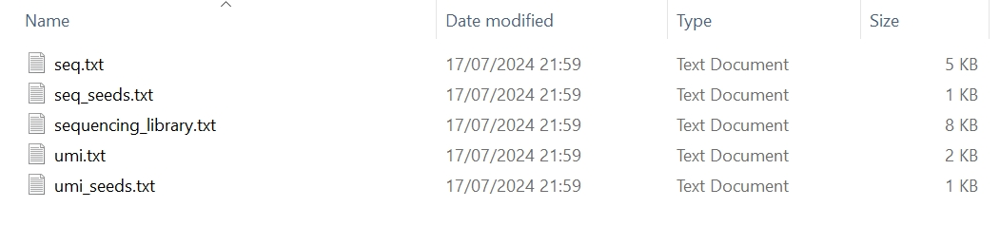
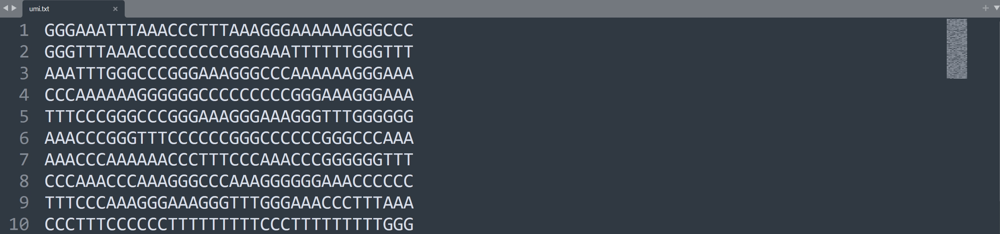
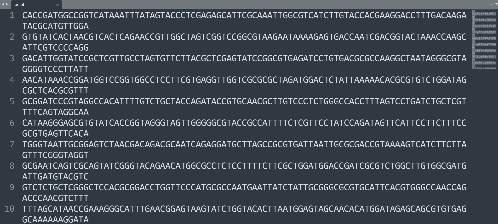
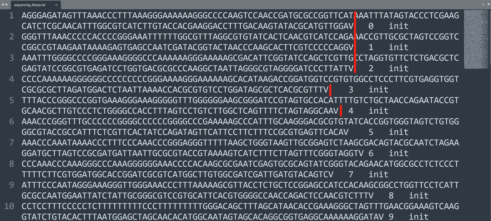
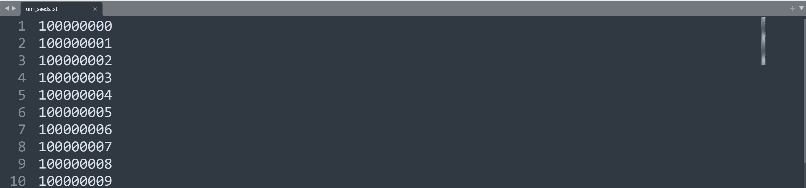

`tresor.locus.library` can be used to simulate substitutions, deletions, and insertions during bead synthesis in the context of a given genomic locus.

# Usage

We use keywords `bead_mut_rate`, `bead_del_rate`, and `bead_ins_rate` to tell Tresor the error rates of substitutions, deletions, and insertions. They activate upon setting`bead_mutation`, `bead_deletion`, and `bead_insertion` as `True`. We **highlight** where the code works for this purpose in the `tresor.locus.library` command. There are a few studies in connection with synthesis error rates [^2]^&^[^3].

[^2]: Potapov V, Ong JL (2017) Examining Sources of Error in PCR by Single-Molecule Sequencing. PLOS ONE 12(1): e0169774. https://doi.org/10.1371/journal.pone.0169774
[^3]: Mitchell, K., Brito, J.J., Mandric, I. et al. Benchmarking of computational error-correction methods for next-generation sequencing data. Genome Biol 21, 71 (2020). https://doi.org/10.1186/s13059-020-01988-3

To show an observable change in the length of reads after applying indels, `bead_ins_rate` increases to 0.1 supposedly.

=== "Python"

    ``` py hl_lines="23-28"
    import tresor as ts

    ts.locus.library(
        seq_num=50,
        len_params={
            'umi': {
                'umi_unit_pattern': 3,
                'umi_unit_len': 12,
            },
            'seq': 100,
        },
        seq_params={
            'custom': 'AAGC',  # BAGC
            'custom_1': 'V',
        },
        material_params={
            'fasta_cdna_fpn': to('data/Homo_sapiens.GRCh38.cdna.all.fa.gz'),  # None False
        },
        is_seed=True,

        working_dir=to('data/simu/docs/'),

        bead_mutation=True,  # True False
        bead_mut_rate=1e-4,  # 0.016 0.00004
        bead_deletion=True,  # True False
        bead_insertion=True,
        bead_del_rate=0.1,  # 0.016 0.00004, 2.4e-7
        bead_ins_rate=7.1e-7,  # 0.011 0.00001, 7.1e-7

        condis=['umi', 'custom', 'seq', 'custom_1'],
        sim_thres=3,
        permutation=0,

        mode='short_read',  # long_read short_read

        verbose=False,  # False True
    )
    
    ```

=== "Shell"

    ``` c++ linenums="1"
    tresor library_sl \
    -cfpn ./tresor/data/libslocus.yml \
    -snum 50 \
    -permut 0 \
    -sthres 3 \
    -wd ./tresor/data/simu/ \
    -md short_read \
    -is True \
    -vb True

    ```


# Attributes
!!! Illustration

    === "Python"
        | Attribute      | Description                          |
        | :---------- | :----------------------------------- |
        | `seq_num`       | number of RNA molecules. `50` by default  |
        | `len_params`       | lengths of different components of a read |
        | `seq_params`    | sequences of different components of a read, It allows users to add their customised sequences |
        | `material_params`    | a Python dictionary. Showing if cDNA libraries are provided, please use key word `fasta_cdna_fpn`. The human cDNA library can be downloaded through the [Ensembl genome](https://ftp.ensembl.org/pub/release-112/fasta/homo_sapiens/cdna) database |
        | `is_seed`    | if seeds are used to simulate sequencing libraries. This is designed to make in silico experiments reproducible |
        | `working_dir`    | working directory where all simulation results are about to be saved |
        | `condis`    | names of components that a read contains. It can contains an unlimited number of read components |
        | `sim_thres`    | similarity threshold. `3` by default |
        | `permutation`    | permutation times |
        | :material-information-variant-circle: `bead_mutation`    | if mutations are simutated during the period of building libraries. `False` by default |
        | :material-information-variant-circle: `bead_mut_rate`    | mutation rate. Workable when bead_mutation is set to `True` |
        | :material-information-variant-circle: `bead_deletion`    | if mutations are simutated during the period of :material-information-variant-circle:building libraries. `False` by default |
        | :material-information-variant-circle: `bead_del_rate`    | deletion rate. Workable when bead_deletion is set to `True`. |
        | :material-information-variant-circle: `bead_insertion`    | if mutations are simutated during the period of building libraries. `False` by default |
        | :material-information-variant-circle: `bead_ins_rate`    | insertion rate. Workable when bead_insertion is set to `True` |
        | `mode` | `long_read` or `short_read` |
        | `verbose` | whether to print intermediate results |
        

    === "Shell"
        | Attribute      | Description                          |
        | :---------- | :----------------------------------- |
        | `cfpn` | location to the yaml configuration file. Users can specify the atrributes illustrated on the **Python** tab in the `.yml` file. |
        | `snum` | number of sequencing molecules |
        | `permut` | permutation times |
        | `sthres` | similarity threshold. `3` by default |
        | `wd` | working directory where all simulation results are about to be saved |
        | `md` | `long_read` or `short_read` mode |
        | `is` | if seeds are used to simulate sequencing libraries. This is designed for reproducible in silico experiments |
        | `vb` | whether to print intermediate results |

        ```

# Extension

!!! tip

    We can flexibly design the structure of a read by adding different components to `condis` separated by comma. For example, there is an initial read containing only a UMI.
    ``` py
    condis=['umi'],
    ```

    Next, we can add a `seq` next to it.
    ``` py
    condis=['umi', 'seq'],
    ```

    If we have a read containing many bespoke parts, `primer`, `primer_1`, `spacer`, `spacer_1`, `adapter`, `adapter_1`,`umi`, `umi_1`, 'seq', and 'seq_2', we can set `condis` just as
    ``` py
    condis=['umi', 'primer', 'primer_1', 'spacer', 'spacer_1', 'adapter', 'adapter_1', 'seq', 'seq_2', 'umi_1'],
    ```

    Then, we can add the corresponding lengths of the parts/components in `len_params` as follows.
    ``` py
    len_params={
        'umi': {
            'umi_unit_pattern': 3,
            'umi_unit_len': 12,
        },
        'umi_1': {
            'umi_unit_pattern': 3,
            'umi_unit_len': 12,
        },
        'seq': 100,
        'seq_2': 100,
        'adapter': 10,
        'adapter_1': 10,
        'primer': 10,
        'primer_1': 10,
        'spacer': 10,
        'spacer_1': 10,
    },
    ```
    
    If you have known sequences of some components in read 1, you can use `seq_params` to specify customed sequences.
    The following settings were used in our recently released biotechnology, [anchor-enhanced technology](https://www.biorxiv.org/content/10.1101/2024.04.08.587145v2), for elevating the discovery of long-reads. We placed an anchor sequence `BAGC` and a `V` base in between the read 1 sequence where B means any type of a base. Tresor was used for simulating reads with the two custom sequences placed as follows.
    ``` py
    seq_params={
        'custom': 'AAGC',  # BAGC
        'custom_1': 'V',
    },
    ```


# Output
## Console
``` py
17/07/2024 22:10:20 logger: Initialisation and parameters: 
{'seq_params': {'custom': 'AAGC', 'custom_1': 'V'}, 'material_params': {'fasta_cdna_fpn': None}, 'mode': 'short_read', 'bead_mutation': True, 'bead_mut_rate': 0.0001, 'bead_deletion': True, 'bead_del_rate': 0.016, 'bead_insertion': True, 'bead_ins_rate': 0.1}
17/07/2024 22:10:20 logger: ======>Sequencing library preparation starts
17/07/2024 22:10:20 logger: ======>Condition map: {'umi': ['alone'], 'custom': ['alone', '1'], 'seq': ['alone']}
17/07/2024 22:10:20 logger: ======>Read 1 generation
17/07/2024 22:10:20 logger: =========>UMI generation start
17/07/2024 22:10:20 logger: ============>UMI condition 0: umi
17/07/2024 22:10:20 logger: =========>Sequence generation start
17/07/2024 22:10:20 logger: ============>Sequence condition 0: seq
17/07/2024 22:10:20 logger: ============>Custom-designed condition 0: custom
17/07/2024 22:10:20 logger: ============>Custom-designed condition 1: custom_1
17/07/2024 22:10:20 logger: ======>Read 2 generation
17/07/2024 22:10:20 logger: =========>UMI generation start
17/07/2024 22:10:20 logger: ============>UMI condition 0: umi
17/07/2024 22:10:20 logger: =========>Sequence generation start
17/07/2024 22:10:20 logger: ============>Sequence condition 0: seq
17/07/2024 22:10:20 logger: ============>Custom-designed condition 0: custom
17/07/2024 22:10:20 logger: ============>Custom-designed condition 1: custom_1
17/07/2024 22:10:20 logger: ======>Read 3 generation
17/07/2024 22:10:20 logger: =========>UMI generation start
17/07/2024 22:10:20 logger: ============>UMI condition 0: umi
17/07/2024 22:10:20 logger: =========>Sequence generation start
17/07/2024 22:10:20 logger: ============>Sequence condition 0: seq
17/07/2024 22:10:20 logger: ============>Custom-designed condition 0: custom
17/07/2024 22:10:20 logger: ============>Custom-designed condition 1: custom_1

...

17/07/2024 22:10:20 logger: ======>Read 49 generation
17/07/2024 22:10:20 logger: =========>UMI generation start
17/07/2024 22:10:20 logger: ============>UMI condition 0: umi
17/07/2024 22:10:20 logger: =========>Sequence generation start
17/07/2024 22:10:20 logger: ============>Sequence condition 0: seq
17/07/2024 22:10:20 logger: ============>Custom-designed condition 0: custom
17/07/2024 22:10:20 logger: ============>Custom-designed condition 1: custom_1
17/07/2024 22:10:20 logger: ======>Read 50 generation
17/07/2024 22:10:20 logger: =========>UMI generation start
17/07/2024 22:10:20 logger: ============>UMI condition 0: umi
17/07/2024 22:10:20 logger: =========>Sequence generation start
17/07/2024 22:10:20 logger: ============>Sequence condition 0: seq
17/07/2024 22:10:20 logger: ============>Custom-designed condition 0: custom
17/07/2024 22:10:20 logger: ============>Custom-designed condition 1: custom_1
17/07/2024 22:10:20 logger: ===>Time for sequencing library preparation: 0.200s

```

## Understanding files
The resultant files of the simulated sequencing library are shown in the following picture. The cDNA library for reference is not used. Randomly simulating reads is enabled.

<figure markdown="span">
  { width="800" }
  <figcaption><strong>Fig</strong> 1. Generated files of a sequencing library</figcaption>
</figure>

In this case, we used homotrimer blocks to simulate UMIs where the length of each UMI is set to be 36 containing 12 trimer blocks.

<figure markdown="span">
  { width="800" }
  <figcaption><strong>Fig</strong> 2. Simulated UMIs</figcaption>
</figure>

The sequences are randomly chosen from the input human cDNAs and truncated according to the length of each short read. 
<figure markdown="span">
  { width="800" }
  <figcaption><strong>Fig</strong> 3. Simulated genomics sequences</figcaption>
</figure>

The sequencing library is tabulated to a dataframe. Each row shows the necessary information about the read 1

1. Sequence
2. Identifier
3. Source

Init means a read 1 is a sequence from the sequencing library, to differ from those from PCR amplification.

{==

Here, we can see a clear difference in the length of simulated reads. Most of reads have increased because of a high insertion rate is set to test the function.

==}

<figure markdown="span">
  { width="800" }
  <figcaption><strong>Fig</strong> 4. Simulated sequencing library</figcaption>
</figure>

We set a big integer as an initial seed to sequentially simulate each UMI sequence. Then, users can use the saved seeds to reproduce the experiment.

<figure markdown="span">
  { width="800" }
  <figcaption><strong>Fig</strong> 5. Seeds for simulating UMIs </figcaption>
</figure>

Seeds used for simulating genomic sequences are recorded.
<figure markdown="span">
  { width="800" }
  <figcaption><strong>Fig</strong> 6. Seeds for simulating sequences </figcaption>
</figure>