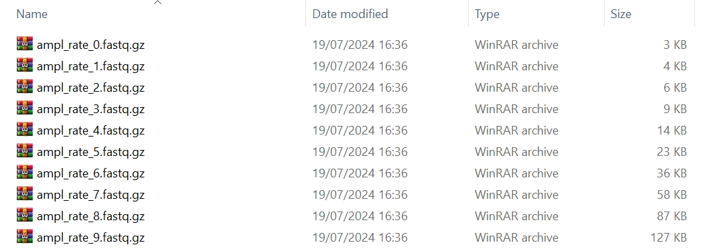

`tresor.locus.simu_ampl_rate` is a Python function in charge of simulating reads with respect to a series of amplication rates in the context of a given genomic locus.

# Usage

We take the following command as an example to generate FastQ files at amplication efficiencies from 0.1 to 1.

=== "Python"

    ``` py hl_lines="25-30 32-34"
    import tresor as ts

    for perm_i in range(1):
        print(perm_i)
        ts.locus.simu_ampl_rate(
            # initial sequence generation
            len_params={
                'umi': {
                    'umi_unit_pattern': 1,
                    'umi_unit_len': 10,
                },
                'seq': 100,
            },
            material_params={
                'fasta_cdna_fpn': to('data/Homo_sapiens.GRCh38.cdna.all.fa.gz'),  # None False
            },
            seq_num=50,
            working_dir=to('data/simu/docs/') + 'permute_' + str(perm_i) + '/',

            condis=['umi', 'seq'],
            sim_thres=3,
            permutation=perm_i,

            # PCR amplification setting
            ampl_rates=np.linspace(0.1, 1, 10),
            err_route='err2d',  # bftree sptree err1d err2d mutation_table_minimum mutation_table_complete
            pcr_error=1e-5,
            pcr_num=8,
            err_num_met='nbinomial', # nbinomial

            # sequencing setting
            seq_error=0.001,
            # seq_sub_spl_number=200, # None
            seq_sub_spl_rate=1,  # 0.333

            use_seed=True,
            seed=1,

            verbose=True,  # True False
            mode='short_read',  # long_read short_read

            sv_fastq_fp=to('data/simu/docs/') + 'permute_' + str(perm_i) + '/',
        )
    ```

=== "Shell"

    ``` c++ linenums="1"
    tresor amplrate_sl \
    -cfpn ./tresor/data/amplrate_sl.yml \
    -snum 50 \
    -permut 0 \
    -sthres 3 \
    -wd ./tresor/data/simu/ \
    -md short_read \
    -is True \
    -vb True
    ```


# Attributes
!!! Illustration

    === "Python"
        | Attribute      | Description                          |
        | :---------- | :----------------------------------- |
        | `seq_num` | number of RNA molecules. `50` by default  |
        | `len_params` | lengths of different components of a read |
        | `seq_params` | sequences of different components of a read, It allows users to add their customised sequences |
        | `material_params` | a Python dictionary. Showing if cDNA libraries are provided, please use key word `fasta_cdna_fpn`. The human cDNA library can be downloaded through the [Ensembl genome](https://ftp.ensembl.org/pub/release-112/fasta/homo_sapiens/cdna) database |
        | `ampl_rates` | list of float numbers ranging from 0 to 1 |
        | `err_route` | the computational algorithm to generate errors. There are 6 methods, including `bftree`, `sptree`, `err1d`, `err2d`, `mutation_table_minimum`, and `mutation_table_complete`. |
        | `pcr_error` | PCR error rate |
        | `pcr_num` | number of PCR cycles to amplify reads |
        | `err_num_met` | the method to generate errors, that is, `binomial` or `nbinomial` |
        | `seq_error` | sequencing error rate |
        | `seq_sub_spl_number` | number of subsampling PCR amplified reads. It exists when `seq_sub_spl_rate` is specified to `None` |
        | `seq_sub_spl_rate` | rate of subsampling PCR amplified reads. It exists when `seq_sub_spl_number` is specified to `None` |
        | `sv_fastq_fp` | folder to save FastQ files |
        | `is_seed` | if seeds are used to simulate sequencing libraries. This is designed to make in silico experiments reproducible |
        | `working_dir` | working directory where all simulation results are about to be saved |
        | `condis` | names of components that a read contains. It can contains an unlimited number of read components |
        | `sim_thres` | similarity threshold. `3` by default |
        | `permutation` | permutation times |
        | `mode` | `long_read` or `short_read` |
        | `verbose` | whether to print intermediate results |
        
    === "Shell"
        | Attribute      | Description                          |
        | :---------- | :----------------------------------- |
        | `cfpn` | location to the yaml configuration file. Users can specify the atrributes illustrated on the **Python** tab in the `.yml` file. |
        | `snum` | number of sequencing molecules |
        | `permut` | permutation times |
        | `sthres` | similarity threshold. `3` by default |
        | `wd` | working directory where all simulation results are about to be saved |
        | `md` | `long_read` or `short_read` mode |
        | `is` | if seeds are used to simulate sequencing libraries. This is designed for reproducible in silico experiments |
        | `vb` | whether to print intermediate results |


# Output
## Console
``` py
17/07/2024 22:10:20 logger: Initialisation and parameters: 
{'seq_params': {'custom': 'AAGC', 'custom_1': 'V'}, 'material_params': {'fasta_cdna_fpn': None}, 'mode': 'short_read', 'bead_mutation': True, 'bead_mut_rate': 0.0001, 'bead_deletion': True, 'bead_del_rate': 0.016, 'bead_insertion': True, 'bead_ins_rate': 0.1}
17/07/2024 22:10:20 logger: ======>Sequencing library preparation starts
17/07/2024 22:10:20 logger: ======>Condition map: {'umi': ['alone'], 'custom': ['alone', '1'], 'seq': ['alone']}
17/07/2024 22:10:20 logger: ======>Read 1 generation
17/07/2024 22:10:20 logger: =========>UMI generation start
17/07/2024 22:10:20 logger: ============>UMI condition 0: umi
17/07/2024 22:10:20 logger: =========>Sequence generation start
17/07/2024 22:10:20 logger: ============>Sequence condition 0: seq
17/07/2024 22:10:20 logger: ============>Custom-designed condition 0: custom
17/07/2024 22:10:20 logger: ============>Custom-designed condition 1: custom_1
17/07/2024 22:10:20 logger: ======>Read 2 generation
17/07/2024 22:10:20 logger: =========>UMI generation start
17/07/2024 22:10:20 logger: ============>UMI condition 0: umi
17/07/2024 22:10:20 logger: =========>Sequence generation start
17/07/2024 22:10:20 logger: ============>Sequence condition 0: seq
17/07/2024 22:10:20 logger: ============>Custom-designed condition 0: custom
17/07/2024 22:10:20 logger: ============>Custom-designed condition 1: custom_1
17/07/2024 22:10:20 logger: ======>Read 3 generation
17/07/2024 22:10:20 logger: =========>UMI generation start
17/07/2024 22:10:20 logger: ============>UMI condition 0: umi
17/07/2024 22:10:20 logger: =========>Sequence generation start
17/07/2024 22:10:20 logger: ============>Sequence condition 0: seq
17/07/2024 22:10:20 logger: ============>Custom-designed condition 0: custom
17/07/2024 22:10:20 logger: ============>Custom-designed condition 1: custom_1

...

19/07/2024 16:51:28 logger: ===>Sequencing library generation starts
19/07/2024 16:51:28 logger: Initialisation and parameters: 
{'mode': 'short_read', 'material_params': {'fasta_cdna_fpn': 'D:\\Document\\Programming\\Python\\tresor\\tresor\\data/Homo_sapiens.GRCh38.cdna.all.fa.gz'}, 'seq_params': {'custom': 'AAGC', 'custom_1': 'A'}}
19/07/2024 16:51:28 logger: ======>Sequencing library preparation starts
19/07/2024 16:51:28 logger: ======>Condition map: {'umi': ['alone'], 'seq': ['alone']}
19/07/2024 16:51:28 logger: ======>Read CDNAs from a reference ome
19/07/2024 16:51:34 logger: ======>There are 204083 genes in the reference genome
19/07/2024 16:51:34 logger: ======>Read 1 generation
19/07/2024 16:51:34 logger: =========>UMI generation start
19/07/2024 16:51:34 logger: ============>UMI condition 0: umi
19/07/2024 16:51:34 logger: =========>Sequence generation start
19/07/2024 16:51:34 logger: ============>Sequence condition 0: seq
19/07/2024 16:51:34 logger: ======>Read 2 generation
19/07/2024 16:51:34 logger: =========>UMI generation start
19/07/2024 16:51:34 logger: ============>UMI condition 0: umi
19/07/2024 16:51:34 logger: =========>Sequence generation start
19/07/2024 16:51:34 logger: ============>Sequence condition 0: seq

...

19/07/2024 16:51:34 logger: ======>Read 49 generation
19/07/2024 16:51:34 logger: =========>UMI generation start
19/07/2024 16:51:34 logger: ============>UMI condition 0: umi
19/07/2024 16:51:34 logger: =========>Sequence generation start
19/07/2024 16:51:34 logger: ============>Sequence condition 0: seq
19/07/2024 16:51:34 logger: ======>Read 50 generation
19/07/2024 16:51:34 logger: =========>UMI generation start
19/07/2024 16:51:34 logger: ============>UMI condition 0: umi
19/07/2024 16:51:34 logger: =========>Sequence generation start
19/07/2024 16:51:34 logger: ============>Sequence condition 0: seq
19/07/2024 16:51:34 logger: ===>Time for sequencing library preparation: 6.698s
19/07/2024 16:51:35 logger: ===>Sequencing library has been generated
19/07/2024 16:51:35 logger: ===>PCR amplification starts...
19/07/2024 16:51:35 logger: ======>Assign parameters...
19/07/2024 16:51:35 logger: ======>0. Amplification rate: 0.1
19/07/2024 16:51:35 logger: ===>at PCR 1
19/07/2024 16:51:35 logger: ===>Error assignment method: err2d
19/07/2024 16:51:35 logger: ======>sampling...
19/07/2024 16:51:35 logger: ======>numbering...
19/07/2024 16:51:35 logger: ======>ordering...
19/07/2024 16:51:35 logger: =========>The number of objects to be shuffling: 50
19/07/2024 16:51:35 logger: =========>start shuffling...
19/07/2024 16:51:35 logger: =========>shuffling time: 0.0
19/07/2024 16:51:35 logger: ======>Generate PCR errors...
19/07/2024 16:51:35 logger: =========>The error 2D method is being used
19/07/2024 16:51:35 logger: ======>time for merging sequences 0.00s
19/07/2024 16:51:35 logger: ======>Summary report:
19/07/2024 16:51:35 logger: =========>PCR time: 0.00s
19/07/2024 16:51:35 logger: =========>the dimensions of the data: number of reads: (54, 3)
19/07/2024 16:51:35 logger: =========>the number of reads at this PCR: [], 
19/07/2024 16:51:35 logger: =========>the number of nucleotides at this PCR: [], 
19/07/2024 16:51:35 logger: =========>the number of errors at this PCR: [], 

...

19/07/2024 16:51:38 logger: ===>at PCR 8
19/07/2024 16:51:38 logger: ===>Error assignment method: err2d
19/07/2024 16:51:38 logger: ======>sampling...
19/07/2024 16:51:38 logger: ======>numbering...
19/07/2024 16:51:38 logger: ======>ordering...
19/07/2024 16:51:38 logger: =========>The number of objects to be shuffling: 6400
19/07/2024 16:51:38 logger: =========>start shuffling...
19/07/2024 16:51:38 logger: =========>shuffling time: 0.004994630813598633
19/07/2024 16:51:38 logger: ======>Generate PCR errors...
19/07/2024 16:51:38 logger: =========>The error 2D method is being used
19/07/2024 16:51:39 logger: ======>time for merging sequences 0.30s
19/07/2024 16:51:39 logger: ======>Summary report:
19/07/2024 16:51:39 logger: =========>PCR time: 0.55s
19/07/2024 16:51:39 logger: =========>the dimensions of the data: number of reads: (12800, 3)
19/07/2024 16:51:39 logger: =========>the number of reads at this PCR: [], 
19/07/2024 16:51:39 logger: =========>the number of nucleotides at this PCR: [], 
19/07/2024 16:51:39 logger: =========>the number of errors at this PCR: [], 
19/07/2024 16:51:39 logger: ======>PCR amplification completes in 1.1190292835235596s
19/07/2024 16:51:39 logger: ======>Sequencing starts
19/07/2024 16:51:39 logger: ======>sampling...
19/07/2024 16:51:39 logger: ======>Generate sequencing errors...
19/07/2024 16:51:39 logger: =========>There are 12800 reads to be sequenced
19/07/2024 16:51:39 logger: =========>The position table construction starts
19/07/2024 16:51:39 logger: =========>Time for constructing the position table: 0.196s
19/07/2024 16:51:39 logger: =========>There are 1408000 nucleotides to be sequenced
19/07/2024 16:51:39 logger: =========>Determination of number of sequencing errors start
19/07/2024 16:51:39 logger: ============>There are 1388 nucleotide errors during sequencing
19/07/2024 16:51:39 logger: =========>Time for determining sequencing errors: 0.000s
19/07/2024 16:51:39 logger: =========>Sequencing error Assignment starts
19/07/2024 16:51:39 logger: =========>Time for assigning sequencing errors: 0.10s
19/07/2024 16:51:39 logger: =========>Sequencing time: 0.37s
19/07/2024 16:51:39 logger: =========>Sequencing has completed
19/07/2024 16:51:39 logger: =========>Reads write to files in FastQ format
======>simulation completes in 4.705037355422974s
19/07/2024 16:51:39 logger: =========>FastQ file is saved
19/07/2024 16:51:39 logger: ======>Simulation completes
===>Time: 11.667s
Finished!
```

## Understanding files
The resultant files of the simulated reads are shown as follows.

<figure markdown="span">
  { width="800" }
  <figcaption><strong>Fig</strong> 1. Generated FastQ files</figcaption>
</figure>
