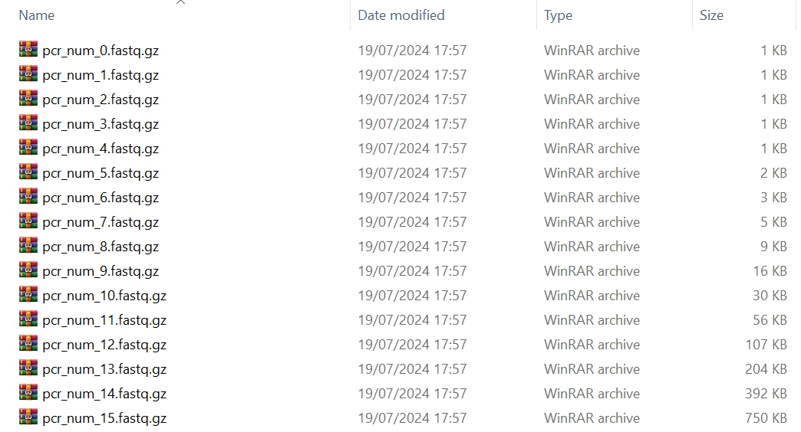

`tresor.locus.simu_pcr_num` is a Python function in charge of simulating reads with respect to a series of PCR cycles in the context of a given genomic locus.

# Usage

We take the following command as an example to generate FastQ files with PCR cycles from 1 to 16.

=== "Python"

    ``` py hl_lines="25-30 32-34"
    import tresor as ts

    for perm_i in range(1):
        print(perm_i)
        ts.locus.simu_pcr_num(
            # initial sequence generation
            len_params={
                'umi': {
                    'umi_unit_pattern': 1,
                    'umi_unit_len': 10,
                },
                'seq': 100,
            },
            material_params={
                'fasta_cdna_fpn': to('data/Homo_sapiens.GRCh38.cdna.all.fa.gz'),  # None False
            },
            seq_num=50,
            working_dir=to('data/simu/docs/') + 'permute_' + str(perm_i) + '/',

            condis=['umi', 'seq'],
            sim_thres=3,
            permutation=perm_i,

            # PCR amplification setting
            ampl_rate=0.85,
            err_route='err2d',  # bftree sptree err1d err2d mutation_table_minimum mutation_table_complete
            pcr_error=1e-5,
            pcr_nums=np.arange(1, 16 + 1, 1),
            err_num_met='nbinomial', # nbinomial

            # sequencing setting
            seq_error=0.001,
            # seq_sub_spl_number=200, # None
            seq_sub_spl_rate=1,  # 0.333

            use_seed=True,
            seed=1,

            verbose=True,  # True False
            mode='short_read',  # long_read short_read

            sv_fastq_fp=to('data/simu/docs/') + 'permute_' + str(perm_i) + '/',
        )
    ```

=== "Shell"

    ``` c++ linenums="1"
    tresor amplrate_sl \
    -cfpn ./tresor/data/amplrate_sl.yml \
    -snum 50 \
    -permut 0 \
    -sthres 3 \
    -wd ./tresor/data/simu/ \
    -md short_read \
    -is True \
    -vb True
    ```


# Attributes
!!! Illustration

    === "Python"
        | Attribute      | Description                          |
        | :---------- | :----------------------------------- |
        | `seq_num` | number of RNA molecules. `50` by default  |
        | `len_params` | lengths of different components of a read |
        | `seq_params` | sequences of different components of a read, It allows users to add their customised sequences |
        | `material_params` | a Python dictionary. Showing if cDNA libraries are provided, please use key word `fasta_cdna_fpn`. The human cDNA library can be downloaded through the [Ensembl genome](https://ftp.ensembl.org/pub/release-112/fasta/homo_sapiens/cdna) database |
        | `ampl_rate` | amplification rate |
        | `err_route` | the computational algorithm to generate errors. There are 6 methods, including `bftree`, `sptree`, `err1d`, `err2d`, `mutation_table_minimum`, and `mutation_table_complete`. |
        | `pcr_error` | PCR error rate |
        | `pcr_nums` | list of numbers of PCR cycles to amplify reads |
        | `err_num_met` | the method to generate errors, that is, `binomial` or `nbinomial` |
        | `seq_error` | sequencing error rate |
        | `seq_sub_spl_number` | number of subsampling PCR amplified reads. It exists when `seq_sub_spl_rate` is specified to `None` |
        | `seq_sub_spl_rate` | rate of subsampling PCR amplified reads. It exists when `seq_sub_spl_number` is specified to `None` |
        | `sv_fastq_fp` | folder to save FastQ files |
        | `is_seed` | if seeds are used to simulate sequencing libraries. This is designed to make in silico experiments reproducible |
        | `working_dir` | working directory where all simulation results are about to be saved |
        | `condis` | names of components that a read contains. It can contains an unlimited number of read components |
        | `sim_thres` | similarity threshold. `3` by default |
        | `permutation` | permutation times |
        | `mode` | `long_read` or `short_read` |
        | `verbose` | whether to print intermediate results |
        
    === "Shell"
        | Attribute      | Description                          |
        | :---------- | :----------------------------------- |
        | `cfpn` | location to the yaml configuration file. Users can specify the atrributes illustrated on the **Python** tab in the `.yml` file. |
        | `snum` | number of sequencing molecules |
        | `permut` | permutation times |
        | `sthres` | similarity threshold. `3` by default |
        | `wd` | working directory where all simulation results are about to be saved |
        | `md` | `long_read` or `short_read` mode |
        | `is` | if seeds are used to simulate sequencing libraries. This is designed for reproducible in silico experiments |
        | `vb` | whether to print intermediate results |


# Output
## Console
``` py
======>simulation completes in 0.006001472473144531s
======>simulation completes in 0.015999555587768555s
======>simulation completes in 0.031002521514892578s
======>simulation completes in 0.0520024299621582s
======>simulation completes in 0.0820016860961914s
======>simulation completes in 0.13100123405456543s
======>simulation completes in 0.21903324127197266s
======>simulation completes in 0.3820035457611084s
======>simulation completes in 0.6550242900848389s
======>simulation completes in 1.172032117843628s
======>simulation completes in 2.121032476425171s
======>simulation completes in 3.855032205581665s
======>simulation completes in 7.238165855407715s
======>simulation completes in 13.530180931091309s
======>simulation completes in 27.088150024414062s
======>simulation completes in 50.08818531036377s
===>Time: 51.309s
Finished!
```

## Understanding files
The resultant files of the simulated reads are shown as follows.

<figure markdown="span">
  { width="800" }
  <figcaption><strong>Fig</strong> 1. Generated FastQ files</figcaption>
</figure>
