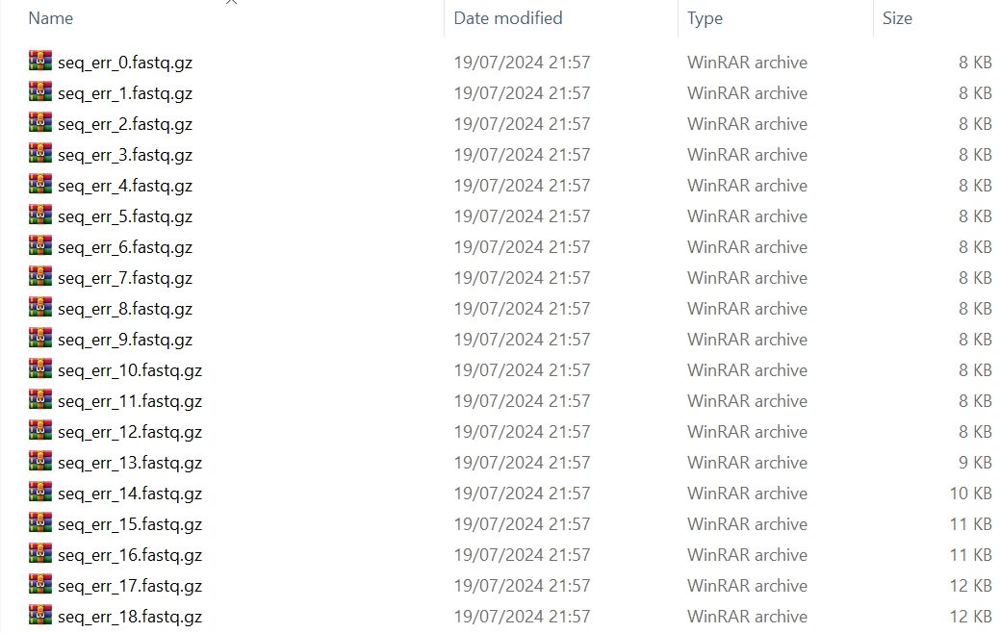

`tresor.sc.simu_seq_err` is a Python function in charge of simulating reads with respect to a series of sequencing errors at the scRNA-seq level.

# Usage

We take the following command as an example to generate FastQ files at sequencing errors of `1e-05`, `2.5e-05`, `5e-05`, `7.5e-05`, `0.0001`, `0.00025`, `0.0005`, `0.00075`, `0.001`, `0.0025`, `0.005`, `0.0075`, `0.01`, `0.025`, `0.05`, `0.075`, `0.1`, `0.2`, and `0.3`.

=== "Python"

    ``` py hl_lines="27-31 34-36"
    import tresor as ts

    for perm_i in range(1):
        print(perm_i)
        ts.sc.simu_seq_err(
            # initial sequence generation
            gspl=gspl,

            len_params={
                'umi': {
                    'umi_unit_pattern': 3,
                    'umi_unit_len': 12,
                },
                'seq': 100,
            },
            material_params={
                'fasta_cdna_fpn': to('data/Homo_sapiens.GRCh38.cdna.all.fa.gz'),  # None False
            },
            seq_num=50,
            working_dir=to('data/simu/docs/'),
    
            condis=['barcode', 'umi', 'seq'],
            sim_thres=3,
            permutation=0,
    
            # PCR amplification
            ampl_rate=0.9,
            err_route='sptree',  # bftree sptree err1d err2d mutation_table_minimum mutation_table_complete
            pcr_error=1e-4,
            pcr_num=10,
            err_num_met='nbinomial',
            
            # PCR amplification
            seq_errors=[1e-05, 2.5e-05, 5e-05, 7.5e-05, 0.0001, 0.00025, 0.0005, 0.00075, 0.001, 0.0025, 0.005, 0.0075, 0.01, 0.025, 0.05, 0.075, 0.1, 0.2, 0.3],
            seq_sub_spl_number=200, # None
            # seq_sub_spl_rate=0.333,

            use_seed=True,
            seed=1,
    
            verbose=False,  # True False
            mode='short_read',  # long_read short_read
    
            sv_fastq_fp=to('data/simu/docs/'),
        )
    ```

=== "Shell"

    ``` c++ linenums="1"
    tresor seqerr_sc \
    -cfpn ./tresor/data/amplrate_sl.yml \
    -snum 50 \
    -permut 0 \
    -sthres 3 \
    -wd ./tresor/data/simu/ \
    -md short_read \
    -is True \
    -vb True
    ```


# Attributes
!!! Illustration

    === "Python"
        | Attribute      | Description                          |
        | :---------- | :----------------------------------- |
        | `seq_num` | number of RNA molecules. `50` by default  |
        | `len_params` | lengths of different components of a read |
        | `seq_params` | sequences of different components of a read, It allows users to add their customised sequences |
        | `material_params` | a Python dictionary. Showing if cDNA libraries are provided, please use key word `fasta_cdna_fpn`. The human cDNA library can be downloaded through the [Ensembl genome](https://ftp.ensembl.org/pub/release-112/fasta/homo_sapiens/cdna) database |
        | `ampl_rate` | float number ranging from 0 to 1 |
        | `err_route` | the computational algorithm to generate errors. There are 6 methods, including `bftree`, `sptree`, `err1d`, `err2d`, `mutation_table_minimum`, and `mutation_table_complete`. |
        | `pcr_error` | PCR error rate |
        | `pcr_num` | number of PCR cycles to amplify reads |
        | `err_num_met` | the method to generate errors, that is, `binomial` or `nbinomial` |
        | `seq_errors` | list of sequencing error rates |
        | `seq_sub_spl_number` | number of subsampling PCR amplified reads. It exists when `seq_sub_spl_rate` is specified to `None` |
        | `seq_sub_spl_rate` | rate of subsampling PCR amplified reads. It exists when `seq_sub_spl_number` is specified to `None` |
        | `sv_fastq_fp` | folder to save FastQ files |
        | `is_seed` | if seeds are used to simulate sequencing libraries. This is designed to make in silico experiments reproducible |
        | `working_dir` | working directory where all simulation results are about to be saved |
        | `condis` | names of components that a read contains. It can contains an unlimited number of read components |
        | `sim_thres` | similarity threshold. `3` by default |
        | `permutation` | permutation times |
        | `mode` | `long_read` or `short_read` |
        | `verbose` | whether to print intermediate results |
        
    === "Shell"
        | Attribute      | Description                          |
        | :---------- | :----------------------------------- |
        | `cfpn` | location to the yaml configuration file. Users can specify the atrributes illustrated on the **Python** tab in the `.yml` file. |
        | `snum` | number of sequencing molecules |
        | `permut` | permutation times |
        | `sthres` | similarity threshold. `3` by default |
        | `wd` | working directory where all simulation results are about to be saved |
        | `md` | `long_read` or `short_read` mode |
        | `is` | if seeds are used to simulate sequencing libraries. This is designed for reproducible in silico experiments |
        | `vb` | whether to print intermediate results |


# Output
## Console
``` py
======>simulation completes in 0.2249603271484375s
======>simulation completes in 0.2529621124267578s
======>simulation completes in 0.27799153327941895s
======>simulation completes in 0.30399394035339355s
======>simulation completes in 0.33098506927490234s
======>simulation completes in 0.35599184036254883s
======>simulation completes in 0.38298583030700684s
======>simulation completes in 0.40896105766296387s
======>simulation completes in 0.4359622001647949s
======>simulation completes in 0.46796298027038574s
======>simulation completes in 0.501960277557373s
======>simulation completes in 0.5379629135131836s
======>simulation completes in 0.5689854621887207s
======>simulation completes in 0.6139862537384033s
======>simulation completes in 0.6669600009918213s
======>simulation completes in 0.7449617385864258s
======>simulation completes in 0.8219916820526123s
======>simulation completes in 0.9509828090667725s
======>simulation completes in 1.1259870529174805s
Finished!
```

## Understanding files
The resultant files of the simulated reads are shown as follows.

<figure markdown="span">
  { width="800" }
  <figcaption><strong>Fig</strong> 1. Generated FastQ files</figcaption>
</figure>
